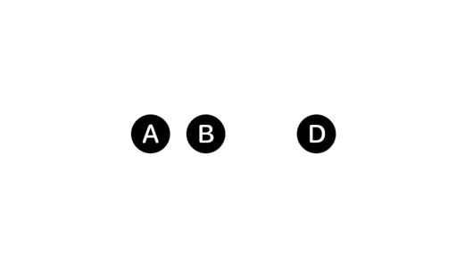

# View configuration

调整层次结构中视图的特征。

SwiftUI 允许你使用视图修饰符调整视图的外观和行为。

许多修饰符适用于特定类型视图或特定行为，但也有一些修饰符具有更广泛的应用性。例如，你可以通过动态设置透明度来有条件地隐藏任何视图，在用户悬停在视图上时显示上下文帮助信息，或为视图请求浅色或深色外观。

## Hiding views

### `opacity(_:)`

设置此视图的透明度。

```swift
func opacity(_ opacity: Double) -> some View
```

- `opacity`: 一个介于 $0$（完全透明）和 $1$（完全不透明）之间的值。


应用不透明度以显示位于另一个视图之后的视图，或减弱对某个视图的强调。

当对一个已经经过不透明度转换的视图应用 `opacity(_:)` 修改器时，该修改器会将效果与底层的不透明度转换相乘。

下面的例子展示了两个重叠的黄色和红色矩形。上方的黄色矩形将其不透明度设置为 $50\%$，从而使下方矩形被遮挡部分可见：


```swift
struct Opacity: View {
    var body: some View {
        VStack {
            Color.yellow.frame(width: 100, height: 100, alignment: .center)
                .zIndex(1)
                .opacity(0.5)

            Color.red.frame(width: 100, height: 100, alignment: .center)
                .padding(-40)
        }
    }
}

```


### `hidden()`

无条件地隐藏此视图。


```swift
func hidden() -> some View
```

隐藏的视图是不可见的，不能接收或响应交互。然而，它们保留在视图层次结构中并影响布局。如果你想出于布局目的包含一个视图，但又不想让它显示，可以使用此修饰符。

```swift
HStack {
    Image(systemName: "a.circle.fill")
    Image(systemName: "b.circle.fill")
    Image(systemName: "c.circle.fill")
        .hidden()
    Image(systemName: "d.circle.fill")
}
```



如果你想有条件地在视图层次结构中包含一个视图，请改用 `if` 语句：

```swift
VStack {
    HStack {
        Image(systemName: "a.circle.fill")
        Image(systemName: "b.circle.fill")
        if !isHidden {
            Image(systemName: "c.circle.fill")
        }
        Image(systemName: "d.circle.fill")
    }
    Toggle("Hide", isOn: $isHidden)
}

```
<video src="../video/HiddenIf.mp4" controls="controls"></video>

上述示例中，根据由 `Toggle` 实例控制的 `isHidden` 状态变量的当前值，SwiftUI 会绘制圆圈或者完全将其从布局中省略。

## Hiding system elements

### `labelsHidden()`

隐藏该视图内包含的所有控件的标签。

```swift
func labelsHidden() -> some View
```

当你希望从用户界面中的一个或多个控件中省略标签时，可以使用此修饰符。例如，以下示例中的第一个 `Toggle` 隐藏了其标签：

```swift
VStack {
    Toggle(isOn: $toggle1) {
        Text("Toggle 1")
    }
    .labelsHidden()


    Toggle(isOn: $toggle2) {
        Text("Toggle 2")
    }
}
```


在上述示例中，第一个 `VStack` 将第一个切换开关的控制元素居中于可用空间中，而第二个切换开关的组合标签和控制元素则整体居中：


即使隐藏了标签，也始终为控件提供一个标签，因为 SwiftUI 将标签用于其他目的，包括辅助功能。

::: info
此修饰符并不适用于所有标签。它仅适用于与控件其余界面分开的标签，如 `Toggle` 的情况，但不适用于像带有边框的按钮这样的控件，其中标签位于按钮边框内。
:::


### `menuIndicator(_:)`

为该视图内的控件设置菜单指示器的可见性。

```swift
func menuIndicator(_ visibility: Visibility) -> some View
```


使用此修饰符可覆盖此视图中控件的默认菜单指示器可见性。例如，下面的代码创建了一个没有指示器的菜单：


```swift
Menu {
    ForEach(history , id: \.self) { historyItem in
        Button(historyItem.title) {
            self.openURL(historyItem.url)
        }
    }
} label: {
    Label("Back", systemImage: "chevron.backward")
        .labelStyle(.iconOnly)
} primaryAction: {
    if let last = history.last {
        self.openURL(last.url)
    }
}
.menuIndicator(.hidden)
```


::: info

在 tvOS 上，标准按钮样式不包含菜单指示器，因此在使用内置按钮样式时，此修饰符将不起作用。你可以在自己的 `ButtonStyle` 实现中通过检查 `menuIndicatorVisibility` 环境值来实现指示器。
:::


### `statusBarHidden(_:)`

设置状态栏的可见性。

```swift
func statusBarHidden(_ hidden: Bool = true) -> some View
```


<video src="../video/StatusBarHidden.mp4" controls="controls"></video>


### `persistentSystemOverlays(_:)`

设置覆盖在应用程序上的非临时系统视图（如状态栏和导航栏）的首选可见性。

```swift
func persistentSystemOverlays(_ visibility: Visibility) -> some View
```

如果你希望通过对隐藏或显示可能影响用户体验的系统叠加层来自定义应用的沉浸式体验，请使用此修改器。以下示例隐藏所有持久性的系统叠加。

```swift
struct ContentView: View {

    var body: some View {

        Text("This needs to take up lots of space")
            .frame(maxWidth: .infinity, maxHeight: .infinity)
            .background(.yellow)
            .persistentSystemOverlays(.hidden)
    }
}

```

请注意，此修改器仅设置一个偏好设置，最终系统将决定是否遵守该偏好。这些非临时系统视图包括：

- `Home` 指示器
- `SharePlay` 指示器
- iPad 上的多任务指示器和画中画功能

系统可能会根据运行时的情况（如系统政策、用户设置或特定交互需求）来决定是否遵循你设置的偏好。


## Managing view interaction

### `disabled(_:)`

添加了一个条件，用于控制用户是否可以与该视图进行交互。

```swift
func disabled(_ disabled: Bool) -> some View
```

在视图层级结构中，位于较高等级的视图可以覆盖你在此视图上设置的值。在以下示例中，按钮不是可交互的，因为外部的 `disabled(_:)`修饰符覆盖了内部的修饰符：

```swift
HStack {
    Button(Text("Press")) {}
    .disabled(false)
}
.disabled(true)
```

### `isEnabled`

一个布尔值，表示与此环境关联的视图是否允许用户交互。默认为 `true`。


```swift
var isEnabled: Bool { get set }
```

### `interactionActivityTrackingTag(_:)`

设置一个用于跟踪交互性的标签。

```swift
func interactionActivityTrackingTag(_ tag: String) -> some View
```

以下示例跟踪列表的滚动活动：

```swift
List {
    Section("Today") {
        ForEach(messageStore.today) { message in
            Text(message.title)
        }
    }
}
.interactionActivityTrackingTag("MessagesList")
```

解决的活动跟踪标签是累加的，所以在视图层级结构中使用此修饰符会从上到下构建标签。下面的例子展示了这个修饰符的层次结构用法，产生的标签为 `Home-Feed`：

```swift
var body: some View {
    Home()
        .interactionActivityTrackingTag("Home")
}


struct Home: View {
    var body: some View {
        List {
            Text("A List Item")
            Text("A Second List Item")
            Text("A Third List Item")
        }
        .interactionActivityTrackingTag("Feed")
    }
}
```

::: info
在 SwiftUI 中，`interactionActivityTrackingTag` 是用于跟踪视图内的用户交互活动的标签。它可以帮助开发者识别和分析用户如何与应用的不同部分进行交互。这个功能主要用于性能监控和用户行为分析，可以与 App 的分析工具集成，收集关于视图如何被用户使用的详细数据。

通过给视图添加 `interactionActivityTrackingTag` 标签，开发者可以在用户与这个特定视图交互时启动数据收集。例如，可以跟踪点击事件、滑动行为或任何其他交互类型，这有助于了解用户的行为模式，从而优化用户体验和应用性能。这个标签提供了一种简单的方式来分类和标记用户交互，使得在大型项目中进行用户行为分析和性能跟踪更加高效。
:::

### `invalidatableContent(_:)`

标记接收者，表示其内容可能会失效。

```swift
func invalidatableContent(_ invalidatable: Bool = true) -> some View
```

使用此修饰符来注解显示从数据当前状态派生的值的视图，这些值可能会在响应用户交互等情况时失效。

当环境中存在 `RedactionReasons.invalidated` 时，视图将改变其外观。

在交互式部件中，从用户与部件上的控件交互开始，直到呈现新的时间线更新为止，视图都将处于失效状态。


::: info

在 SwiftUI 中，`invalidatableContent(_:)` 是一个用于标记视图内容可能需要在未来被更新或无效化的修饰符。这通常用于那些因为用户交互或外部数据变化而可能需要更新显示的视图。例如，当数据状态发生改变时，通过此修饰符，视图可以表明其内容可能需要更新，从而触发界面的重新渲染。这在动态的用户界面中特别有用，例如在使用小组件或实时数据更新的应用中。

这个修饰符特别适用于提高应用的反应速度和减少感知延迟，因为它允许开发者明确哪些视图的内容是基于动态数据的，并且可能在短时间内频繁更新。通过标记这些内容为可无效化，可以优化应用的性能，尤其是在处理复杂或高频更新的界面时。
:::


## Providing contextual help

### `help(_:)`

使用您提供的本地化字符串为视图添加帮助文本。

```swift
func help(_ textKey: LocalizedStringKey) -> some View
```

为视图添加帮助会配置该视图的辅助功能提示以及在 macOS 或 visionOS 中的帮助标签（也称为工具提示）。


```swift
Button(action: composeMessage) {
    Image(systemName: "square.and.pencil")
}
.help("Compose a new message")
```


## Adding a glass background

### `glassBackgroundEffect(displayMode:)` <Badge type="info" text="visionOS" />

使用容器相对的圆角矩形形状的玻璃材质填充视图的背景。

```swift
func glassBackgroundEffect(displayMode: GlassBackgroundDisplayMode = .always) -> some View
```


使用此修饰符添加一个具有厚度、镜面反射、玻璃模糊、阴影等效果的 `3D` 玻璃背景材质。由于其具有物理深度，玻璃背景会影响 $z$ 轴方向的布局。

为了确保当您将其添加到 `ZStack` 中的一组视图时效果能正确渲染，应将修饰符添加到堆栈本身，而不是堆栈中的某个视图。这包括当您使用诸如 `overlay(alignment:content:)` 或 `background(alignment:content:)` 这样的视图修饰符隐式创建堆栈时。在这种情况下，您可能需要在内容闭包内创建一个显式的 `ZStack`，以便有地方可以添加玻璃背景修饰符。

