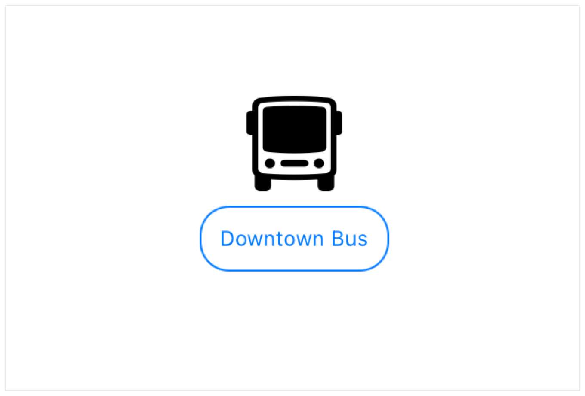

# View fundamentals

使用视图的层级结构来定义应用程序的视觉元素。

视图是用于声明应用程序用户界面的基本构建块。每个视图都包含了给定状态下要显示内容的描述。应用程序中用户可见的每一部分都源自视图中的描述，并且任何遵循 `View` 协议的类型都可以作为应用程序中的视图。


通过在视图的 `body` 计算属性中结合 SwiftUI 提供的内置视图和其他自定义视图来组合一个自定义视图。可以使用 SwiftUI 提供的视图修饰符来配置视图，或者通过实现 `ViewModifier` 协议并使用 `modifier(_:)` 方法来自定义视图修饰符来定义自己的视图修饰符。

## `View`

一种表示应用程序用户界面部分的类型，并提供了用于配置视图的修饰符。

```swift
protocol View
```

通过声明遵循 `View` 协议的类型来创建自定义视图。实现必需的 `body` 计算属性以提供自定义视图的内容。

```swift
struct MyView: View {
    var body: some View {
        Text("Hello, World!")
    }
}

```

通过组合 SwiftUI 提供的一个或多个内置视图（如上例中的 `Text` 实例）以及其他你定义的自定义视图，构建视图的 `body`，形成视图的层级结构。

`View` 协议提供了一组修饰符——即带有默认实现的协议方法，你在应用程序布局中使用这些修饰符来配置视图。修饰符的工作原理是，将调用它们的视图实例包裹在一个具有指定特性的新视图中，如配置视图中所述。例如，向文本视图添加 `opacity(_:)` 修饰符会返回一个具有某种程度透明度的新视图：


```swift
Text("Hello, World!")
.opacity(0.5) // Display partially transparent text.
```

默认修饰符的完整列表提供了大量用于管理视图的控件。例如，你可以微调布局修饰符，添加可访问性修饰符信息，并响应输入和事件修饰符。你还可以将一组默认修饰符收集到新的自定义视图修饰符中，以便于复用。


## `ViewBuilder`

一个自定义参数属性，用于从闭包构造视图。

```swift
@resultBuilder
struct ViewBuilder
```


你通常将 `ViewBuilder` 用作产生子视图的闭包参数的参数属性，使得这些闭包能够提供多个子视图。例如，以下 `contextMenu` 函数接受一个通过视图生成器产生一个或多个视图的闭包：

```swift
func contextMenu<MenuItems: View>(
    @ViewBuilder menuItems: () -> MenuItems
) -> some View
```


该函数的使用者可以使用多语句闭包来提供多个子视图，如下例所示：

```swift
myView.contextMenu {
    Text("Cut")
    Text("Copy")
    Text("Paste")
    if isSymbol {
        Text("Jump to Definition")
    }
}
```

## `modifier(_:)`

应用修改器于视图并返回一个新的视图。

```swift
func modifier<T>(_ modifier: T) -> ModifiedContent<Self, T>
```

使用此修饰符将一个`View`和一个`ViewModifier`结合，以创建一个新的视图。例如，如果你为一种新的带有蓝色文字并被圆角矩形包围的字幕创建了一个视图修饰符：

```swift
struct BorderedCaption: ViewModifier {
    func body(content: Content) -> some View {
        content
            .font(.caption2)
            .padding(10)
            .overlay(
                RoundedRectangle(cornerRadius: 15)
                    .stroke(lineWidth: 1)
            )
            .foregroundColor(Color.blue)
    }
}
```

你可以使用 `modifier(_:)` 来扩展 `View`，以创建新的修饰符以应用上面定义的 `BorderedCaption`：

```swift
extension View {
    func borderedCaption() -> some View {
        modifier(BorderedCaption())
    }
}

```
然后，你可以将带边框的标题应用于任何视图：

```swift
Image(systemName: "bus")
    .resizable()
    .frame(width:50, height:50)
Text("Downtown Bus")
    .borderedCaption()
```



## `EmptyModifier`

一个空的，或者是身份修饰符，用于在开发过程中在编译时切换修饰符。

```swift
@frozen
struct EmptyModifier
```


使用空修饰符在开发期间于编译时切换修饰符。在下面的例子中，当处于调试构建时，`ContentView` 内部的 `Text` 视图会有一个黄色背景和红色边框。而非调试构建则会反映出默认的系统或容器提供的外观。

```swift
struct EmphasizedLayout: ViewModifier {
    func body(content: Content) -> some View {
        content
            .background(Color.yellow)
            .border(Color.red)
    }
}


struct ContentView: View {
    var body: some View {
        Text("Hello, World!")
            .modifier(modifier)
    }

    var modifier: some ViewModifier {
        #if DEBUG
            return EmphasizedLayout()
        #else
            return EmptyModifier()
        #endif
    }
}
```

## `ModifiedContent`

一个附加了修饰符的值。

```swift
@frozen
struct ModifiedContent<Content, Modifier>
```

### `init(content:modifier:)`

一个结构体，用于定义生成新视图或视图修饰符所需的内容和修饰符。

```swift
init(
    content: Content,
    modifier: Modifier
)
```

如果内容是 `View`，而修饰符是 `ViewModifier`，那么结果就是一个 `View`。如果内容和修饰符都是视图修饰符，那么结果就是一个结合了它们的新 `ViewModifier`。


## `EnvironmentalModifier`

一个修饰符，在使用前必须在环境中解析为具体修饰符。

```swift
protocol EnvironmentalModifier : ViewModifier where Self.Body == Never
```

### `resolve(in:)`

在给定环境中解析为具体修饰符。

```swift
func resolve(in environment: EnvironmentValues) -> Self.ResolvedModifier
```

## `onAppear(perform:)`

在该视图出现之前添加要执行的动作。


```swift
func onAppear(perform action: (() -> Void)? = nil) -> some View
```

SwiftUI 调用此方法的确切时机取决于你将其应用于的具体视图类型，但动作闭包会在第一个渲染帧出现之前完成执行。

## `onDisappear(perform:)`

在该视图消失后执行一个动作。

```swift
func onDisappear(perform action: (() -> Void)? = nil) -> some View
```

SwiftUI 调用此方法的确切时间取决于你将其应用于的具体视图类型，但动作闭包直到视图从界面消失后才会执行。

## `task(priority:_:)`

在该视图出现之前添加一个异步任务执行。

```swift
func task(
    priority: TaskPriority = .userInitiated,
    _ action: @escaping () async -> Void
) -> some View
```

- `priority`: 创建异步任务时使用的任务优先级。默认优先级是 `userInitiated`（用户发起）。
- `action`: SwiftUI 在视图出现之前作为异步任务调用的闭包。在操作完成之前，SwiftUI 会在视图消失后的某个时刻自动取消该任务。


使用此修饰符执行与修改后的视图生命周期相匹配的异步任务。如果任务在 SwiftUI 移除视图或视图更改标识符之前未完成，SwiftUI 将取消该任务。

在任务内部使用 `await` 关键字等待异步调用完成，或等待 `AsyncSequence` 实例的值。例如，你可以修改一个 `Text` 视图以启动一个从远程资源加载内容的任务：

```swift
let url = URL(string: "https://example.com")!
@State private var message = "Loading..."


var body: some View {
    Text(message)
        .task {
            do {
                var receivedLines = [String]()
                for try await line in url.lines {
                    receivedLines.append(line)
                    message = "Received \(receivedLines.count) lines"
                }
            } catch {
                message = "Failed to load"
            }
        }
}

```

此示例使用 `lines` 方法将指定 `URL` 处存储的内容作为一个字符串的异步序列获取。每当有新的一行到达时，`for-await-in` 循环的主体会将这一行存储在一个字符串数组中，并更新文本视图的内容以报告最新的行数。

## `task(id:priority:_:)`

在该视图出现之前或指定值更改时执行一个任务。

```swift
func task<T>(
    id value: T,
    priority: TaskPriority = .userInitiated,
    _ action: @escaping () async -> Void
) -> some View where T : Equatable
```

- `id`: 要观察其变化的值。该值必须遵循 `Equatable` 协议。
- `priority`: 创建异步任务时使用的任务优先级。默认优先级是 `userInitiated`（用户发起）。
- `action`: SwiftUI 在视图出现之前作为异步任务调用的闭包。在操作完成之前，SwiftUI 会在视图消失后的某个时刻自动取消该任务。

::: tip 返回值
一个视图，在视图出现之前异步运行指定的操作，或者当 `id` 值改变时重新启动任务。
:::

此方法的行为类似于 `task(priority:_:)`，不同之处在于当指定的值发生变化时，它还会取消并重新创建任务。为了检测变化，修饰符会测试id参数的新值是否等于之前的值。为此，该值的类型必须遵循 `Equatable` 协议。

例如，如果你定义了一个可比较的 `Server` 类型，每当其状态发生变化时（例如，从注销变为已登录）都会发布自定义通知，那么你可以使用 `task` 修饰符来更新 `Text` 视图的内容，以反映当前选定服务器的状态：

```swift
Text(status ?? "Signed Out")
    .task(id: server) {
        let sequence = NotificationCenter.default.notifications(
            named: .didUpdateStatus,
            object: server
        ).compactMap {
            $0.userInfo?["status"] as? String
        }
        for await value in sequence {
            status = value
        }
    }
```

这个例子使用 `notifications(named:object:)` 方法根据 `AsyncSequence` 实例创建了一个异步通知序列。接着，该示例将通知序列映射到与每个通知一起存储的字符串值相对应的字符串序列。

在其他地方，服务器定义了一个自定义的 `didUpdateStatus` 通知：

```swift
extension NSNotification.Name {
    static var didUpdateStatus: NSNotification.Name {
        NSNotification.Name("didUpdateStatus")
    }
}
```


每当服务器状态发生变化时，比如用户登录后，服务器会发布这种自定义类型的通告：

```swift
let notification = Notification(
    name: .didUpdateStatus,
    object: self,
    userInfo: ["status": "Signed In"])
NotificationCenter.default.post(notification)
```


附加到 `Text` 视图的任务会从通知的用户信息字典中获取并显示状态值。当用户选择不同的服务器时，SwiftUI 会取消现有任务并创建一个新的任务，新任务将等待来自新服务器的通知。


## `id(_:)`

将视图的身份绑定到给定的代理值上。

```swift
func id<ID>(_ id: ID) -> some View where ID : Hashable
```

当 `id` 参数指定的代理值发生变化时，视图的身份（例如，它的状态）将被重置。

## `tag(_:)`

为该视图设置唯一的标签值。

```swift
func tag<V>(_ tag: V) -> some View where V : Hashable
```

使用此修饰符可以区分某些可选中的视图，如 `Picker` 的可能值或 `TabView` 的标签页。标签值可以是遵循 `Hashable` 协议的任何类型。

在下面的例子中，`Picker` 视图构建器中的 `ForEach` 循环遍历 `Flavor` 枚举。它提取每个枚举元素的字符串值用于构建行标签，并使用作为可选值的枚举值作为 `tag(_:)`修饰符的输入。`Picker` 要求标签的类型必须与选择类型完全匹配，在这个例子中是一个可选的 `Flavor`。


```swift
struct FlavorPicker: View {
    enum Flavor: String, CaseIterable, Identifiable {
        case chocolate, vanilla, strawberry
        var id: Self { self }
    }

    @State private var selectedFlavor: Flavor? = nil

    var body: some View {
        Picker("Flavor", selection: $selectedFlavor) {
            ForEach(Flavor.allCases) { flavor in
                Text(flavor.rawValue).tag(Optional(flavor))
            }
        }
    }
}
```

如果你将 `selectedFlavor` 更改为非可选类型，则需要从 `tag` 输入中移除 `Optional` 类型转换以保持匹配。

`ForEach` 会自动为每个枚举视图应用一个默认标签，使用相应元素的 `id` 参数。如果元素的 `id` 参数和 `picker` 的选择输入具有完全相同的类型，你可以省略显式的 `tag` 修饰符。

## `equatable()`

当视图的新值与其旧值相同时，阻止视图更新其子视图。

```swift
func equatable() -> EquatableView<Self>
```

当自身遵循 `Equatable` 协议时可用。

## `AnyView`

一个类型擦除的视图。

```swift
@frozen
struct AnyView
```

`AnyView` 允许更改给定视图层次结构中使用的视图类型。每当与 `AnyView` 一起使用的视图类型发生变化时，旧的层次结构将被销毁，并为新类型创建一个新的层次结构。

## `EmptyView`

一个不包含任何内容的视图。

```swift
@frozen
struct EmptyView
```


你几乎不需要直接创建 `EmptyView`。相反，`EmptyView` 代表视图的缺失。

SwiftUI 在以下情形下会使用 `EmptyView` ：当 SwiftUI 视图类型定义了一个或多个带有泛型参数的子视图，并且允许这些子视图不存在时。当子视图不存在时，泛型类型参数中的子视图类型就是 `EmptyView`。

以下示例创建了一个没有标签的不确定进度条 `ProgressView`。`ProgressView` 类型为其子视图声明了两个泛型参数 `Label` 和 `CurrentValueLabel` ，用于子视图的类型。当这两个子视图都缺失时（就像这里的例子），最终类型就是 `ProgressView<EmptyView, EmptyView>`，正如示例输出所示：

```swift
let progressView = ProgressView()
print("\(type(of:progressView))")
// Prints: ProgressView<EmptyView, EmptyView>
```

## `EquatableView`

一种视图类型，它会将自己与其先前的值进行比较，如果新值与其旧值相同，则阻止其子视图更新。

```swift
@frozen
struct EquatableView<Content> where Content : Equatable, Content : View
```

## `SubscriptionView`


一种视图，它通过一个动作订阅发布者（ `publisher` ）。

```swift
@frozen
struct SubscriptionView<PublisherType, Content> where PublisherType : Publisher, Content : View, PublisherType.Failure == Never
```

## `TupleView`

由 Swift 元组中的多个 `View` 值创建的 `View`。

```swift
@frozen
struct TupleView<T>
```