# View styles

为不同类型的视图应用内置和自定义外观及行为。

SwiftUI 为某些类型的视图定义了内置样式，并且会根据特定的展示环境自动选择合适的样式。例如，一个 `Label` 可能会根据不同的因素（如平台、是否出现在工具栏中等）表现为图标、字符串标题或两者兼有。

你可以使用风格视图修饰符之一来覆盖自动样式。这些修饰符通常在整个容器视图中传播，因此你可以将视图层次结构包裹在一个样式修饰符中，以影响层次结构中所有给定类型的视图。

任何定义了 `makeBody(configuration:)` 方法的风格协议，如 `ToggleStyle`，也使你能够定义自定义风格。创建一个遵循相应风格协议的类型并实现其 `makeBody(configuration:)` 方法。然后，像应用内置样式一样，使用样式视图修饰符应用新样式。

## Styling buttons

### `buttonStyle(_:)`

为该视图中的按钮设置样式，采用具有自定义外观和标准交互行为的按钮样式。

```swift
func buttonStyle<S>(_ style: S) -> some View where S : ButtonStyle
```

使用此修饰符为视图中的所有按钮实例设置特定的样式：

```swift
HStack {
    Button("Sign In", action: signIn)
    Button("Register", action: register)
}
.buttonStyle(.bordered)
```

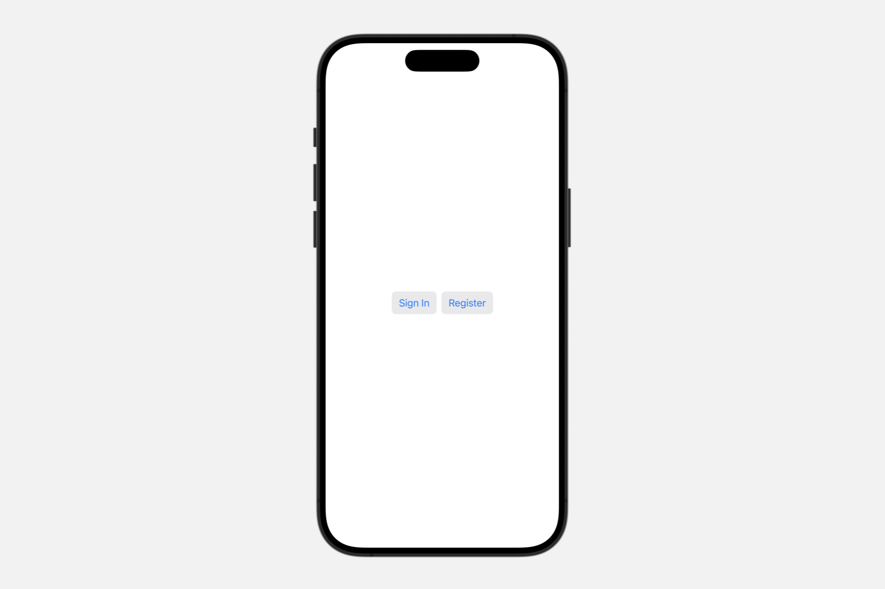

你也可以使用此修饰符为通过组合获得按钮样式的控件设置样式，如下例中的 `Menu` 和 `Toggle` 视图：

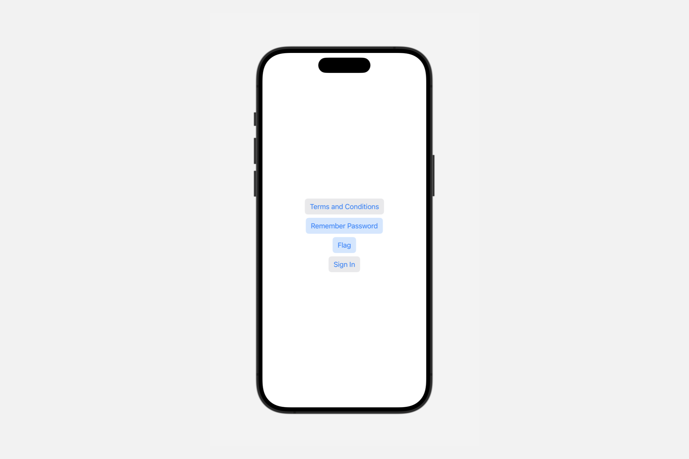

`menuStyle(_:)` 修饰符使得“条款与条件”菜单呈现为按钮形式。类似地，`toggleStyle(_:)` 修饰符使得两个切换开关也呈现为按钮形式。然后，按钮样式修饰符不仅使明确的「登录」按钮，还包括具有按钮样式的菜单和切换开关，都以带边框的按钮样式呈现。

#### `role`

一个可选的语义角色，用于描述按钮的目的或功能。

```swift
let role: ButtonRole?
```

值为 `nil` 表示按钮没有分配角色。如果按钮确实有角色，请使用它来调整按钮的外观。以下示例展示了一种自定义样式，当角色为取消时使用粗体文本，在角色为破坏性时使用红色文本，否则不添加特殊样式：

```swift
struct MyButtonStyle: ButtonStyle {
    func makeBody(configuration: Configuration) -> some View {
        configuration.label
            .font(
                configuration.role == .cancel ? .title2.bold() : .title2)
            .foregroundColor(
                configuration.role == .destructive ? Color.red : nil)
    }
}
```

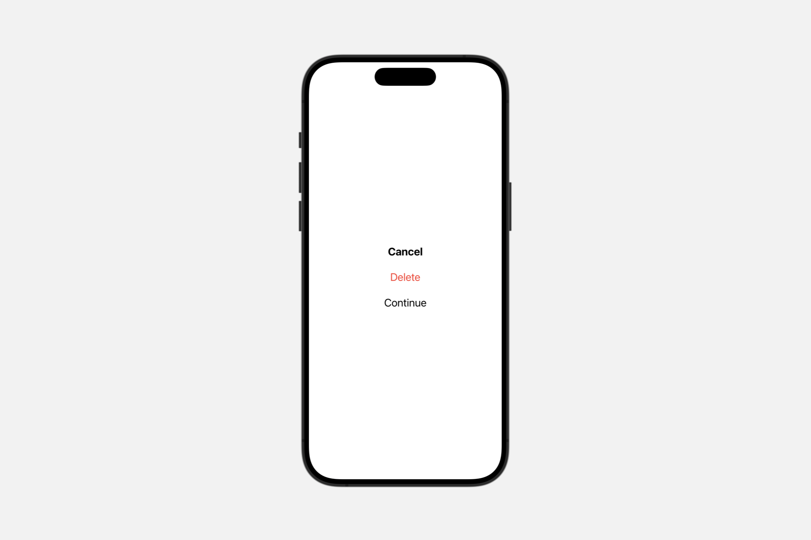

你可以使用此样式创建每种按钮的一个实例，以查看效果：

```swift
VStack(spacing: 20) {
    Button("Cancel", role: .cancel) {}
    Button("Delete", role: .destructive) {}
    Button("Continue") {}
}
.buttonStyle(MyButtonStyle())
```

### `PrimitiveButtonStyle`

一种类型，向视图层次结构中的所有按钮应用自定义交互行为和自定义外观。

```swift
protocol PrimitiveButtonStyle
```

要为视图层次结构配置当前的按钮样式，请使用 `buttonStyle(_:)` 修饰符。指定一个遵循 `PrimitiveButtonStyle` 的样式来创建具有自定义交互行为的按钮。要创建具有针对每个平台定义的标准按钮交互行为的按钮，请改用 `ButtonStyle`。


## Styling pickers

### `pickerStyle(_:)`

为该视图中的选择器设置样式。

```swift
func pickerStyle<S>(_ style: S) -> some View where S : PickerStyle
```

#### `automatic`

基于选择器上下文的默认选择器样式。

使用默认选择器样式的 `picker` 出现的方式在很大程度上取决于平台和其所处的视图类型。例如，在标准视图中，默认选择器样式按平台划分如下：

- 在 iOS 和 watchOS 上，默认是滚轮样式。
- 在 macOS 上，默认是弹出式按钮。
- 在 tvOS 上，默认是分段控制样式。

默认选择器样式在设置选择器外观时，也可能考虑其他因素，比如选择器是否出现在容器视图中。

你可以覆盖选择器的样式。若要将默认样式应用于选择器，或应用于包含选择器的视图，请使用 `pickerStyle(_:)` 修饰符。

```swift
Picker("选择", selection: $selection) {
    Text("Apple").tag(0)
    Text("Banana").tag(1)
    Text("Orange").tag(2)
}
```


#### `inline`

一种 `PickerStyle`，其中每个选项与当前容器中的其他视图并排显示。

```swift
Picker("选择", selection: $selection) {
    Text("Apple").tag(0)
    Text("Banana").tag(1)
    Text("Orange").tag(2)
}.pickerStyle(.inline)
```

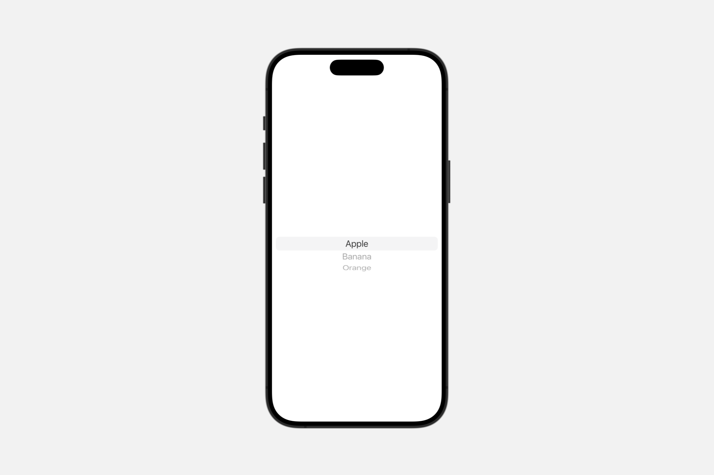

#### `menu`

一种选择器样式，当用户按下按钮时，以菜单形式展示选项；或者在嵌套于更大菜单中时，以子菜单形式展示。

当有超过五个选项时，请使用此风格。如果选项少于五个，可以考虑使用内联样式。

按钮本身表示所选的选项。在选项集中，你可以包含额外的控制元素，比如用于自定义选项列表的按钮。

```swift
Picker("选择", selection: $selection) {
    Text("Apple").tag(0)
    Text("Banana").tag(1)
    Text("Orange").tag(2)
}.pickerStyle(.menu)
```


#### `navigationLink`

由导航链接表示的选择器样式，通过推送列表式选择器视图来展示选项。

在导航栈中，通常首选默认的菜单样式。但当你有大量的选项，或者你的设计通过推入堆栈表达得更好时，请考虑使用导航链接样式。

```swift
NavigationStack {
    Picker("选择", selection: $selection) {
        Text("Apple").tag(0)
        Text("Banana").tag(1)
        Text("Orange").tag(2)
    }.pickerStyle(.navigationLink)
        .padding()
}
```
<video src="../video/NavigationLink.mp4" controls="controls"></video>


#### `palette`

一种选择器样式，将选项以一排紧凑元素的形式展示。

::: warning 注意
在菜单外部使用时，此样式将以分段选择器的形式呈现。如果这是预期的用法，请考虑使用 `segmented` 样式代替。
:::

对于每个选项的标签，如果添加了超过 $6$ 个选项，请为每个项目使用一个符号。在 iOS 上，这样选择器会水平滚动。

以下示例创建了一个调色板选择器：

```swift
enum Reaction: Identifiable, CaseIterable {
    case thumbsup, thumbsdown, heart, questionMark
    var id: Self { self }
}

@State private var selection: Reaction? = .none

var body: some View {
    Menu("Reactions") {
        Picker("Palette", selection: $selection) {
            Label("Thumbs up", systemImage: "hand.thumbsup")
                .tag(Reaction.thumbsup)
            Label("Thumbs down", systemImage: "hand.thumbsdown")
                .tag(Reaction.thumbsdown)
            Label("Like", systemImage: "heart")
                .tag(Reaction.heart)
            Label("Question mark", systemImage: "questionmark")
                .tag(Reaction.questionMark)
        }
        .pickerStyle(.palette)
        Button("Reply...") { ... }
    }
}
```

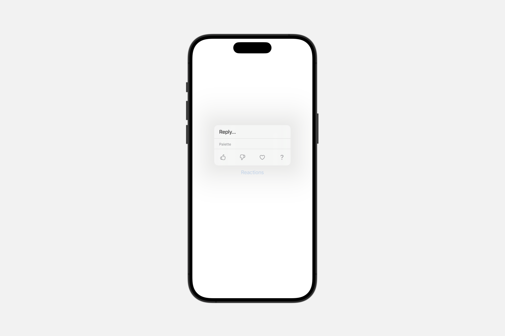

调色板选择器会显示未着色的 SF Symbols 或模板图片，并应用系统着色。对于着色的 SF Symbols，在选择时会在符号周围描边。如果你希望提供特定的图像（或 SF Symbol ）来表示选择，我们建议使用 `custom` 样式。这将禁用任何系统选择行为，从而使提供的图像仅用来指示选择。

以下示例创建了一个调色板选择器，该选择器禁用了系统的选取行为：


```swift
Menu("Reactions") {
    Picker("Palettes", selection: $selection) {
        ForEach(palettes) { palette in
            Label(palette.title, systemImage: selection == palette.id ?
                "circle.dashed.inset.filled" : "circle.fill")
            .tint(palette.tint)
            .tag(palette.id)
        }
    }
    .pickerStyle(.palette)
    .paletteSelectionEffect(.custom)
Button("Reply...") { }
```

<video src="../video/PickerPaletteTint.mp4" controls="controls"></video>


如果更倾向于使用特定的 SF Symbol 变体，则使用 `symbolVariant(_:)`：

```swift
Menu("Reactions") {
    Picker("Flags", selection: $selection) {
        ForEach(palettes) { palette in
            Label(palette.title, systemImage: "flag")
                .tint(palette.tint)
                .tag(palette.id)
        }
    }
    .pickerStyle(.palette)
    .paletteSelectionEffect(.symbolVariant(.slash))
}
```
<video src="../video/PickerPaletteSymbolVariant.mp4" controls="controls"></video>


#### `radioGroup`  <Badge type="tip" text="macOS" />

一种选择器样式，将选项以一组单选按钮的形式展示。

```swift
static var radioGroup: RadioGroupPickerStyle { get }
```

当有两个至五个选项时，请使用此风格。如果有超过五个选项，请考虑使用菜单样式。

对于每个选项的标签，使用句式大写，不要结束标点，如句号或冒号。

<video src="../video/PickerRadioGroup.mp4" controls="controls"></video>


#### `segmented`


一种选择器样式，将选项以分段控制的方式展示。

当有两个到五个选项时，请使用此风格。如果选项多于五个，请考虑使用菜单样式。

对于每个选项的标签，使用句式大写，不添加结束标点，如句号或冒号。

<video src="../video/PickerSegmented.mp4" controls="controls"></video>

#### `wheel`

一种选择器样式，将选项显示在一个可滚动的轮盘中，轮盘上同时展示所选选项及其周围的几个相邻选项。

由于大部分选项不可见，因此请按可预测的顺序组织它们，例如按字母顺序。

<video src="../video/PickerWheel.mp4" controls="controls"></video>


### `datePickerStyle(_:)`

为此视图中的日期选择器设置样式。

```swift
func datePickerStyle<S>(_ style: S) -> some View where S : DatePickerStyle
```

#### `automatic`

日期选择器的默认样式。

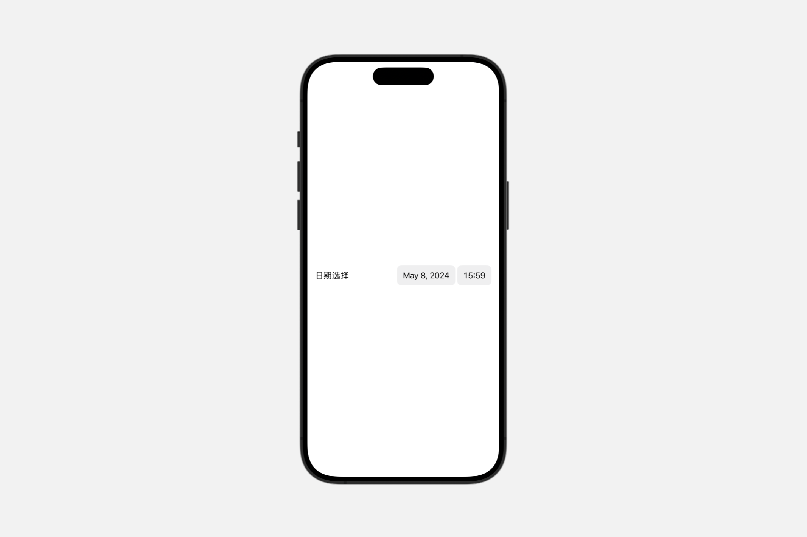

#### `compact`

一种日期选择器样式，以紧凑的文本格式显示各组成部分。

当空间受限且用户期望进行特定的日期和时间选择时，请使用此样式。某些变体可能在弹出窗口中包含丰富的编辑控件。


<video src="../video/DatePickerStyleCompact.mp4" controls="controls"></video>


#### `field` <Badge type="tip" text="macOS" />

一种日期选择器样式，以可编辑字段的形式显示各组成部分。

当空间有限且用户期望进行特定的日期和时间选择时，你可以使用此样式。但是，除非你的应用程序需要隐藏步进器，否则通常应使用 `stepperField` 样式替代此样式。

<video src="../video/DatePickerStyleField.mp4" controls="controls"></video>

#### `graphical`

一种日期选择器样式，显示一个互动的日历或时钟。

当你希望允许用户浏览日历中的日期，或者时钟表面的显示方式较为合适时，此样式非常有用。

<video src="../video/DatePickerStyleGraphical.mp4" controls="controls"></video>


#### `stepperField` <Badge type="tip" text="macOS" />

一种系统样式，以可编辑字段的形式显示各组成部分，并附带有可增减所选组件的步进器。

当空间有限且用户期望进行特定的日期和时间选择时，此样式非常有用。


<video src="../video/DatePickerStyleStepperField.mp4" controls="controls"></video>


#### `wheel`
一种日期选择器样式，将每个部分作为可滚动轮盘中的列进行显示。


<video src="../video/DatePickerStyleWheel.mp4" controls="controls"></video>

## Styling menus

### `menuStyle(_:)`

为此视图中的菜单设置样式。

```swift
func menuStyle<S>(_ style: S) -> some View where S : MenuStyle
```

#### `automatic`

基于菜单上下文的默认菜单样式。

默认的菜单样式可能因平台而异。默认情况下，macOS 使用带边框的按钮样式。

如果你在一个容器中创建一个菜单，该样式的确定会依据该特定平台下该容器内部菜单的推荐样式。例如，嵌套在另一个菜单中的菜单将解析为一个子菜单：


```swift
Menu("Edit") {
    Menu("Arrange") {
        Button("Bring to Front", action: moveSelectionToFront)
        Button("Send to Back", action: moveSelectionToBack)
    }
    Button("Delete", action: deleteSelection)
}

```
<video src="../video/MenuStyleAutomatic.mp4" controls="controls"></video>

#### `button`

一种菜单样式，按下按钮时切换显示菜单内容。

在 macOS 上，按钮显示一个箭头以指示它呈现一个菜单。

按下按钮后拖动进入内容区域，并在释放时激活所选操作。


<video src="../video/MenuStyleButton.mp4" controls="controls"></video>


## Styling toggles


### `toggleStyle(_:)`

为视图层级中的切换按钮设置样式。

```swift
func toggleStyle<S>(_ style: S) -> some View where S : ToggleStyle
```

在 `Toggle` 实例上使用此修饰符，以设置定义控件外观和行为的样式。

::: info

类似于 `toggleStyle(_:)` 为切换按钮所做的，`labelStyle(_:)` 修饰符为层级中的 `Label` 实例设置样式。上面的示例演示了紧凑的仅图标样式( `compact iconOnly` )，这在空间受限的上下文中对按钮切换特别有用。为了更好的可访问性，请始终包含一个描述性的标题。

:::

#### `automatic`

默认的切换按钮样式。

自动样式产生的外观根据平台不同而变化，在大多数上下文中使用以下样式：


| Platform        |      Default style      |
| ------------- | :-----------: |
| iOS, iPadOS      | switch|
| macOS      |   checkbox |
| tvOS      |   A tvOS-specific button style |
| watchOS      |   switch |

tvOS 的默认样式表现得像一个按钮。然而，与某些其他平台上可用的按钮样式不同，tvOS 切换按钮会占用其父容器提供的尽可能多的水平空间，并同时显示切换按钮的标签以及一个指示切换状态的文本字段。通常，你会将 tvOS 切换按钮收集到一个 `List` 中：

```swift
List {
    Toggle("Show Lyrics", isOn: $isShowingLyrics)
    Toggle("Shuffle", isOn: $isShuffling)
    Toggle("Repeat", isOn: $isRepeating)
}
```
<video src="../video/ToggleStyleTVOS.mp4" controls="controls"></video>

切换按钮的自动外观在某些上下文中会有所不同：

作为你提供给任一工具栏修饰符（如 `toolbar(content:)` ）内容一部分出现的切换按钮，默认使用按钮样式。

出现在菜单中的切换按钮使用了一种无法显式创建的样式：

```swift
Menu("Playback") {
    Toggle("Show Lyrics", isOn: $isShowingLyrics)
    Toggle("Shuffle", isOn: $isShuffling)
    Toggle("Repeat", isOn: $isRepeating)
}
```

SwiftUI 显示切换按钮的标签，并且只在开启状态下显示勾选标记：

| Platform        |      Appearance      |
| ------------- | :-----------: |
| iOS, iPadOS      | 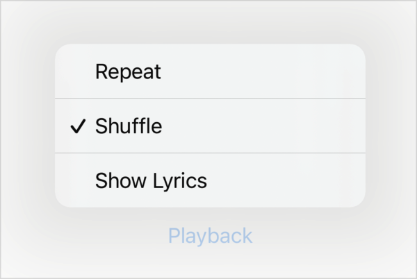 |
| macOS      |   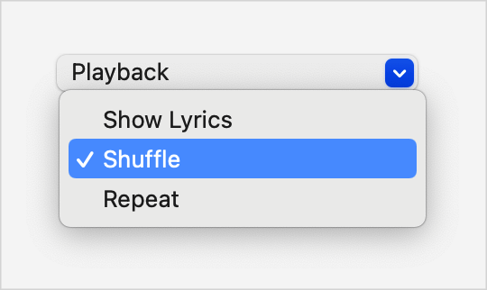    |


#### `button`

一种切换样式，显示为按钮，其标签作为标题。

```swift
Toggle(isOn: $isFlagged) {
    Label("Flag", systemImage: "flag.fill")
}
.toggleStyle(.button)
```

此样式生成一个带有标签的按钮，该标签描述了切换按钮的目的。用户点击或点击按钮来改变切换的状态。按钮通过用着色颜色填充背景来指示开启状态。你可以使用 `tint(_:)` 修饰符更改着色颜色。SwiftUI 将此样式作为出现在工具栏中的切换按钮的默认样式。

下表分别显示了关闭和开启状态下的切换按钮：


| Platform        |      Appearance      |
| ------------- | :-----------: |
| iOS, iPadOS      | 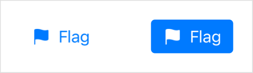 |
| macOS      |   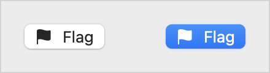    |

`Label` 实例是作为按钮切换标签的一个不错选择。根据上下文，SwiftUI 会决定是否同时显示标题和图标，就像上述示例那样，或者仅当切换按钮出现在工具栏中时只显示图标。你也可以通过添加 `labelStyle(_:)` 修饰符来控制标签的样式。无论如何，SwiftUI 都会始终使用标题通过 `VoiceOver` 来识别控件。

#### `checkbox` <Badge type="tip" text="macOS" />

一种切换样式，显示复选框后跟其标签。


```swift
Toggle("Close windows when quitting an app", isOn: $doesClose)
.toggleStyle(.checkbox)
```

此样式生成一个描述切换目的的标签和一个显示切换状态的复选框。要更改切换状态，用户需点击复选框或其标签：

<video src="../video/ToggleStyleMacOS.mp4" controls="controls"></video>

该样式使复选框的尾部与标签的头部对齐，并根据需要占用水平空间以适应标签的宽度，直至达到切换按钮所在父视图所提供的最大宽度。

在大多数情况下，当你未设置特定样式或应用自动样式时，这便是 macOS 中的默认样式。表单是呈现一系列复选框并保持适当间距和对齐的理想方式。

#### `switch`

一种切换样式，显示前置标签和后置开关。

```swift
Toggle("Enhance Sound", isOn: $isEnhanced)
.toggleStyle(.switch)
```

此样式生成一个描述切换功能的标签和一个显示切换状态的开关。用户点击或敲击开关来改变切换的状态。尽管在用户界面中使用开关的方式因平台而略有不同，如《人机界面指南》中的「切换控件」部分所述，但其默认外观在各平台间基本保持一致。

iOS

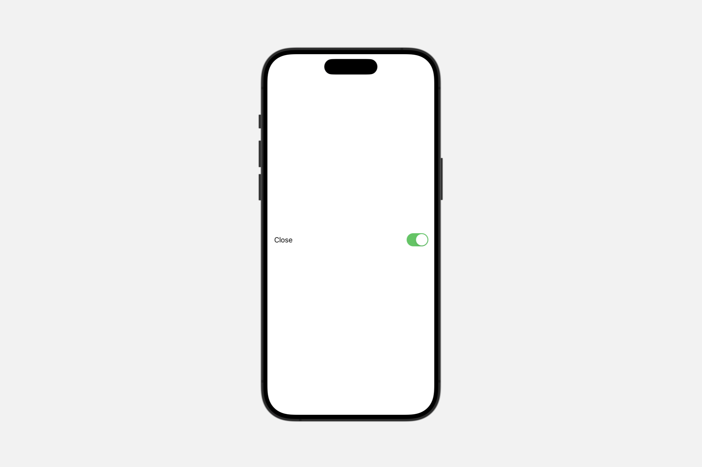

macOS

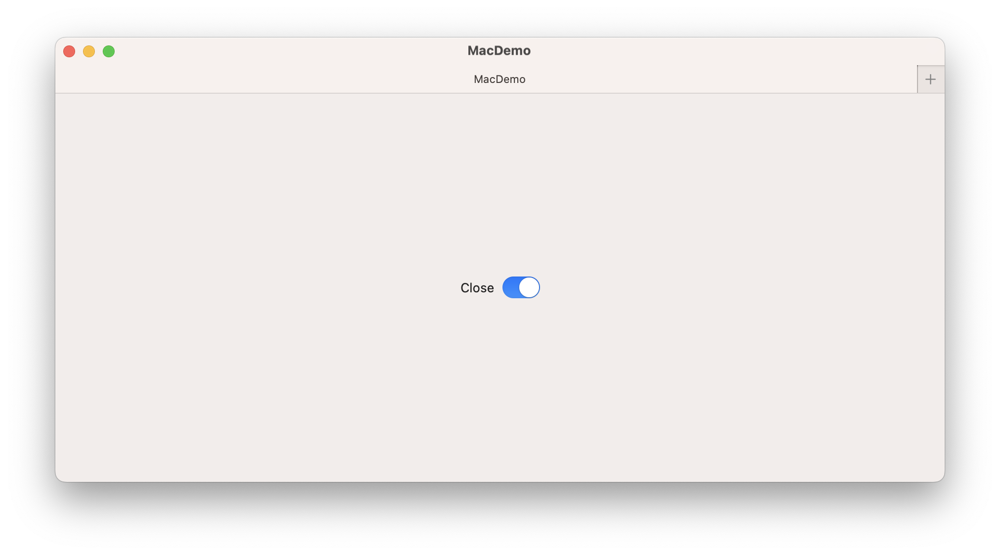

watchOS

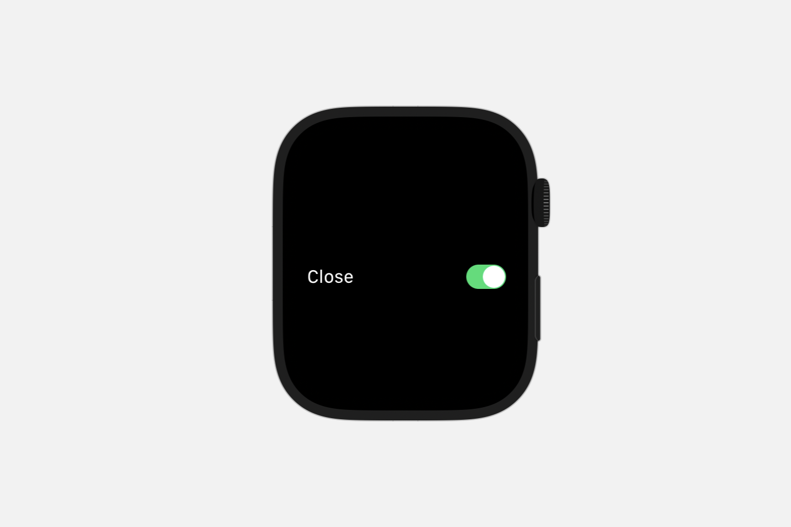


在 iOS 和 watchOS 上，标签和开关会利用父容器提供的全部水平空间，通过将标签的起始边缘与容器视图的起始边缘对齐，以及将开关的结束边缘与容器视图的结束边缘对齐。而在 macOS 上，该样式为了尽可能减少水平空间的占用，会将标签的结束边缘与开关的起始边缘对齐。当此样式出现在表单中时，SwiftUI 会帮助你管理间距和对齐。

当你没有特别设置样式，或者应用了自动样式时，SwiftUI 在大多数情况下会将此样式作为 iOS 和 watchOS 上的默认样式。

## Styling indicators

### `gaugeStyle(_:)`

为此视图中的仪表设置样式。

```swift
func gaugeStyle<S>(_ style: S) -> some View where S : GaugeStyle
```

#### `circular` <Badge type="tip" text="watchOS" />

一种仪表样式，显示一个开放式环形，并带有一个标记，该标记出现在环上的某一点以指示仪表的当前值。

```swift
Gauge(value: batteryLevel, in: 0...100) {
    Text("Num")
}
.gaugeStyle(.circular)
```

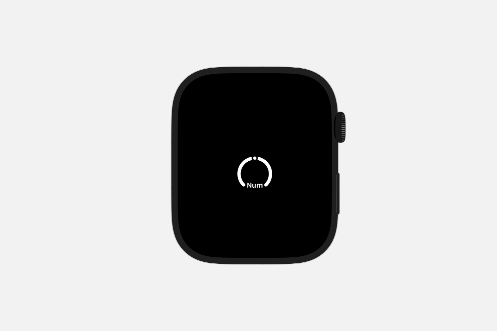

此样式在仪表中心显示仪表的 `currentValueLabel` 值。如果在创建仪表时提供了 `minimumValueLabel` 和 `maximumValueLabel` 参数，它们将出现在环底部的开口处。否则，仪表会将其标签放置在该位置。


#### `accessoryCircular`

这是一种仪表样式，展示了一个开放式环，并带有一个标记，该标记沿着环出现在某个点上以指示仪表的当前值。

```swift
Gauge(value: batteryLevel, in: 0...100) {
    Text("Num")
}
.gaugeStyle(.accessoryCircular)
```

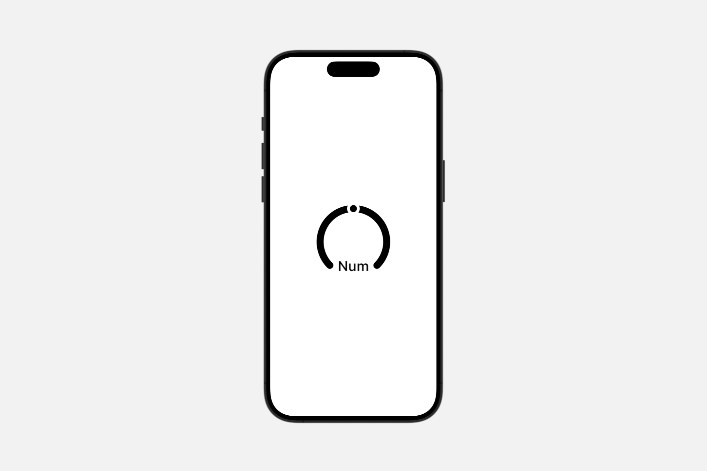

此样式将仪表的 `currentValueLabel` 值显示在仪表的中心。如果你在创建仪表时提供了 `minimumValueLabel` 和 `maximumValueLabel` 参数，它们将出现在环底部的开口处。如果没有提供，仪表则会将其标签放置在那个位置。


#### `accessoryCircularCapacity`

这是一种仪表样式，显示一个闭合的环，并部分填充以指示仪表的当前值。

```swift
Gauge(value: batteryLevel, in: 0...100) {
    Text("Num")
}
.gaugeStyle(.accessoryCircularCapacity)
```
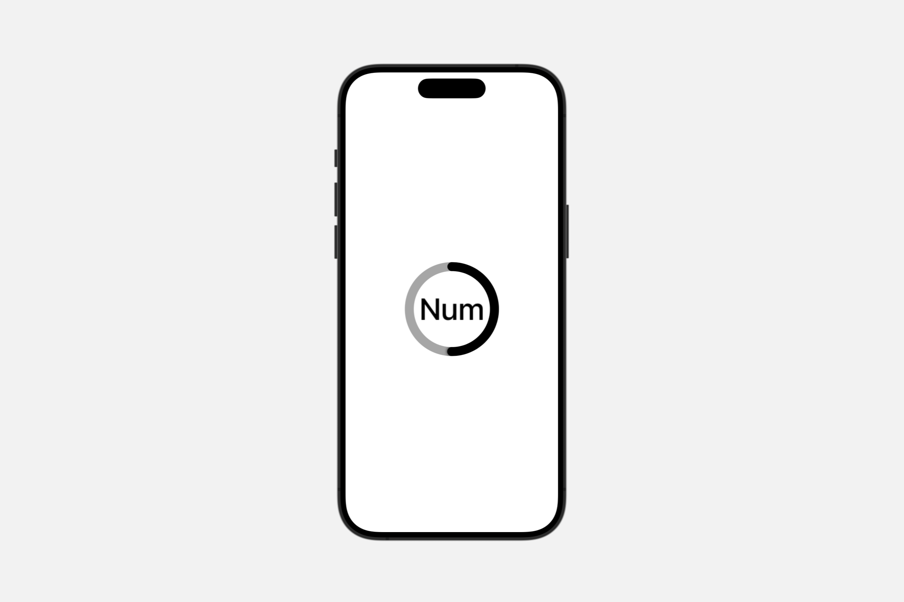

这种风格在仪表的中心显示当前值标签 `currentValueLabel`，以便直观地展示仪表所代表的数据的即时状态。

#### `linear` <Badge type="tip" text="watchOS" />

一种仪表盘样式，显示一条带有标记的条形，该标记出现在条形上的某个点，以指示仪表盘的当前值。

```swift
Gauge(value: batteryLevel, in: 0...100) {
    Text("Num")
}
.gaugeStyle(.linear)
```

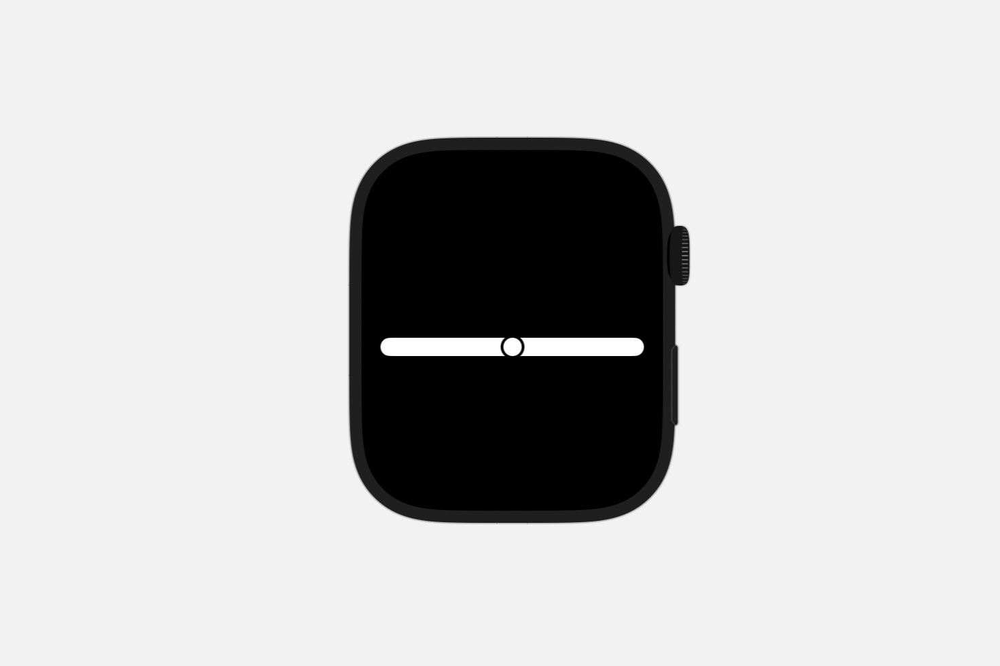

如果你在创建仪表盘时提供了 `minimumValueLabel` 和 `maximumValueLabel` 参数，它们将分别出现在条形的前端和后端。否则，仪表盘将在前端显示 `currentValueLabel` 的值。


#### `linearCapacity`

一种仪表盘样式，其中的条形会随着仪表盘当前值的增加而从前端向后端填充。

```swift
Gauge(value: batteryLevel, in: 0...100) {
    Text("Num")
}
.gaugeStyle(.linearCapacity)
```

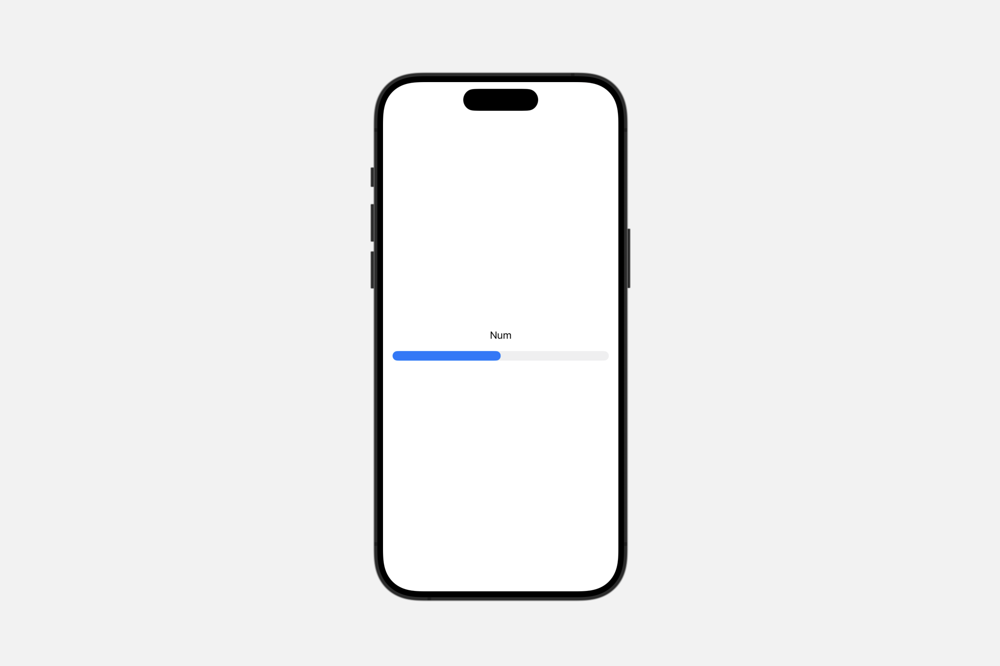

如果你在创建仪表盘时提供了 `minimumValueLabel` 和 `maximumValueLabel` 参数，它们将分别出现在条形的前端和后端。标签显示在仪表盘的上方，而 `currentValueLabel` 则显示在下方。


#### `accessoryLinear`

一种仪表盘样式，展示一根条形，并在其上某一点出现一个标记，以此来指示仪表盘的当前值。

```swift
Gauge(value: batteryLevel, in: 0...100) {
    Text("Num")
}
.gaugeStyle(.accessoryLinear)
```

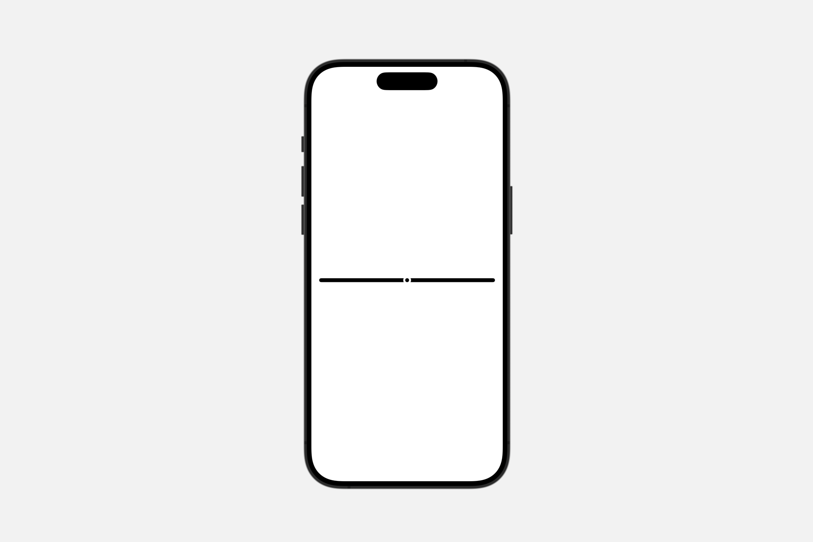

如果在创建仪表盘时提供了 `minimumValueLabel` 和 `maximumValueLabel` 参数，它们将分别显示在条形的起始端和结束端。如果没有提供这些参数，则仪表盘会在起始端显示 `currentValueLabel` 的值。


#### `accessoryLinearCapacity`

一种仪表盘样式，其特点是条形会随着仪表盘当前值的增加而从一端（起始端）向另一端（结束端）填充。

```swift
Gauge(value: batteryLevel, in: 0...100) {
    Text("Num")
}
.gaugeStyle(.accessoryLinearCapacity)
```

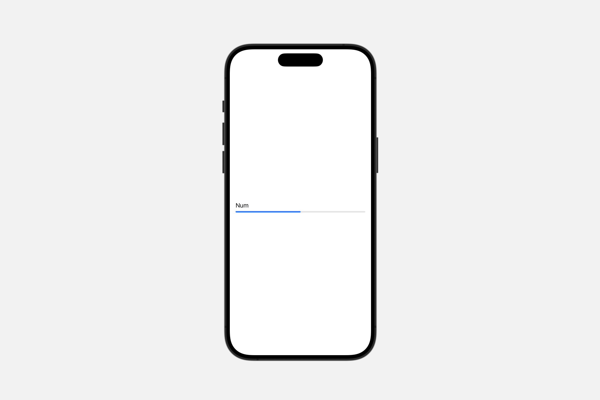

如果在创建仪表盘时提供了 `minimumValueLabel` 和 `maximumValueLabel` 参数，它们将分别显示在条形的前端和后端。标签显示在仪表盘的上方，而 `currentValueLabel`（当前值标签）则显示在下方。


### `progressViewStyle(_:)`

为视图中的进度视图设置样式。

```swift
func progressViewStyle<S>(_ style: S) -> some View where S : ProgressViewStyle
```

#### `automatic`

在被设置样式的视图当前上下文中，默认的进度视图样式。

默认样式代表了基于进度视图最初初始化参数以及在视图层次结构中进度视图上下文的推荐样式。

```swift
 ProgressView()
    .progressViewStyle(.circular)
```

<video src="../video/ProgressViewStyleAutomatic.mp4" controls="controls"></video>


#### `circular`

一种进度视图的风格，它使用圆形仪表盘来表示活动的部分完成情况。


在 watchOS 以及在小部件和复杂功能中，圆形进度视图将以 `accessoryCircularCapacity` 风格呈现为一个仪表盘。如果进度视图是不确定的，则该仪表盘为空。

在没有可用的确定性圆形进度视图风格的情况下，圆形进度视图将采用不确定性的风格。

<video src="../video/ProgressViewStyleCircular.mp4" controls="controls"></video>


#### `linear`

一种进度视图，使用水平条形来直观地指示进度情况。

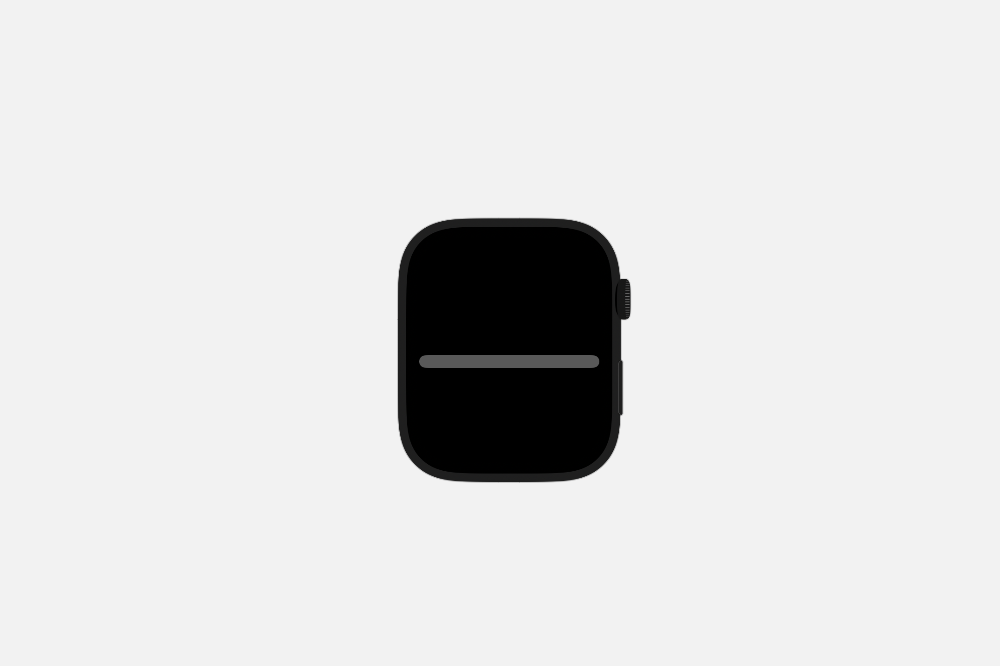

## Styling views that display text

### `labelStyle(_:)`

此操作为该视图中的标签设置样式。

```swift
func labelStyle<S>(_ style: S) -> some View where S : LabelStyle
```

#### `automatic`

一种根据当前上下自动确定其外观的标签样式。

```swift
VStack {
    Label("Fire", systemImage: "flame.fill")
    Label("Lightning", systemImage: "bolt.fill")
}
.labelStyle(.automatic)
```


#### `iconOnly`

一种仅显示标签图标的标签样式。


#### `titleAndIcon`

一种使用系统标准布局同时显示标签的标题和图标的标签样式。

在大多数情况下，默认情况下标签都会同时显示其标题和图标。然而，某些容器可能对其内容应用了不同的默认标签样式，例如在 macOS 和 iOS 上仅在工具栏中显示图标。为了选择同时显示标题和图标，你可以应用 `titleAndIcon` 标签样式：

```swift
Label("Lightning", systemImage: "bolt.fill")
    .labelStyle(.titleAndIcon)
```

要将 `titleAndIcon` 样式应用于一组标签，需将其应用于包含这些标签的视图层次结构中：

```swift
VStack {
    Label("Rain", systemImage: "cloud.rain")
    Label("Snow", systemImage: "snow")
    Label("Sun", systemImage: "sun.max")
}
.labelStyle(.titleAndIcon)
```

标题和图标的相对布局取决于其显示的上下文环境。然而，在大多数情况下，标签是水平排列的，图标位于前方。


#### `titleOnly`

一种仅显示标签标题的标签样式。

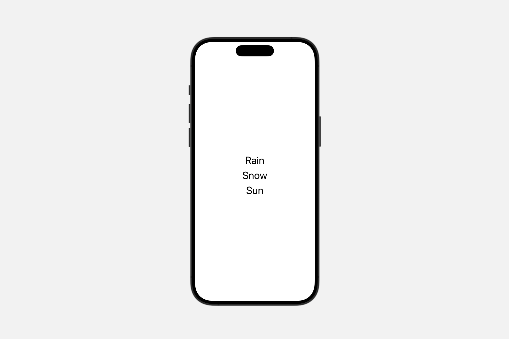


#### Creating custom label styles

```swift
struct MyLabelStyle: LabelStyle {

    func makeBody(configuration: Configuration) -> some View {

        RoundedRectangle(cornerRadius: 25.0)
            .fill(.green.gradient)
            .overlay {
                VStack {
                    configuration.icon
                    configuration.title
                        .bold()
                }.foregroundStyle(.white)

            }.padding()
    }
}
```

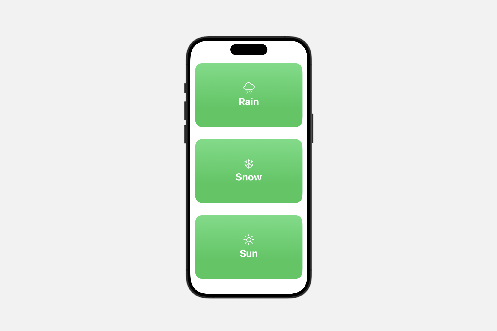


### `textFieldStyle(_:)`

此操作为该视图中的文本字段设置样式。

```swift
func textFieldStyle<S>(_ style: S) -> some View where S : TextFieldStyle
```

#### `automatic`

根据文本字段所在上下文环境的默认文本字段样式。

默认样式代表了根据当前平台及文本字段在视图层级结构中的上下文环境所推荐的样式。

```swift
Form {
    TextField("请输入", text: $text)
        .textFieldStyle(.automatic)
}
```

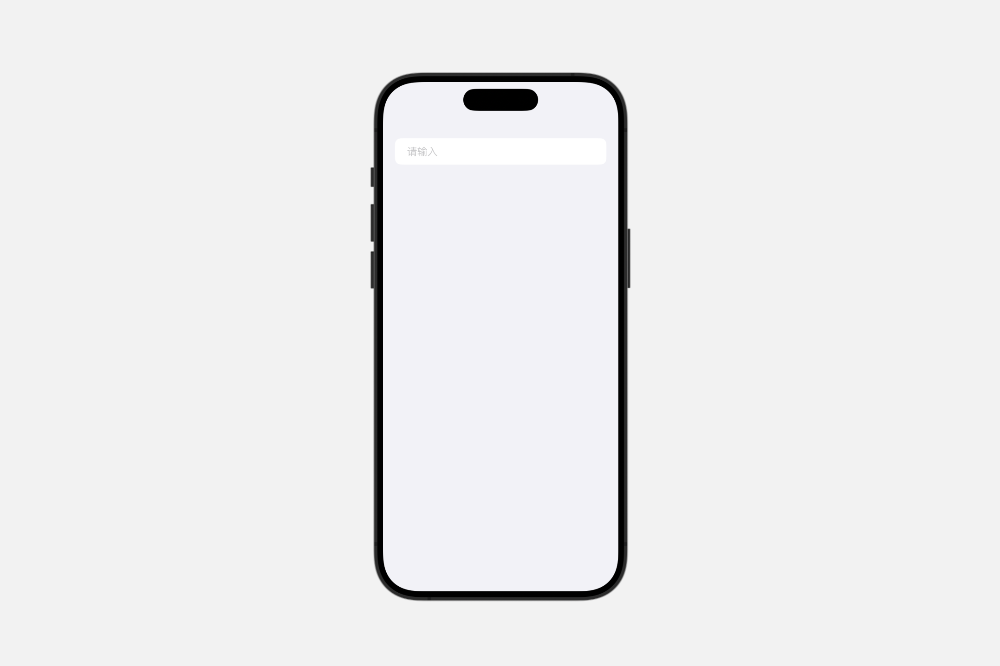


#### `plain`

一种无装饰的文本字段样式。

```swift
Form {
    TextField("请输入", text: $text)
        .textFieldStyle(.plain)
}
```

#### `roundedBorder`

一种带有系统定义圆角边框的文本字段样式。

```swift
ScrollView {
    TextField("请输入", text: $text)
        .textFieldStyle(.roundedBorder)
        .font(.largeTitle)
}.padding()
```

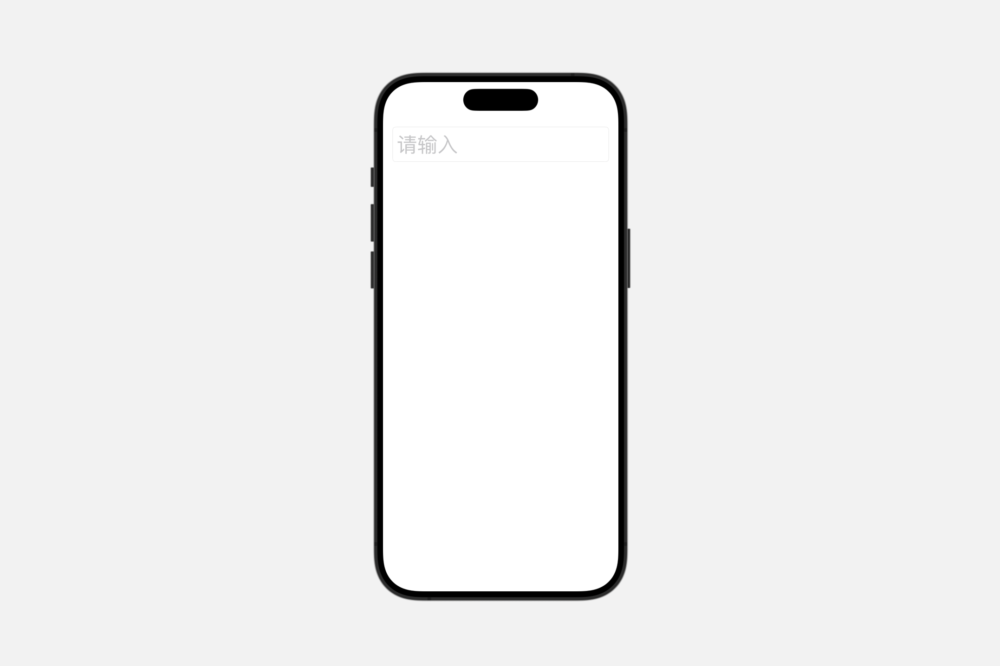


#### `squareBorder` <Badge type="tip" text="macOS" />

一种带有系统定义方形边框的文本字段样式。

```swift
 TextField("请输入", text: $text)
    .textFieldStyle(.squareBorder)
    .frame(width: 200)
```

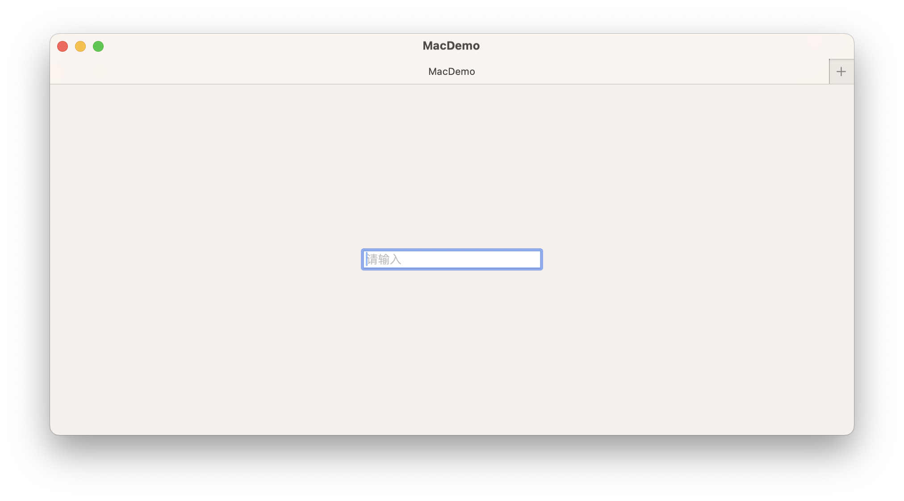


### `textEditorStyle(_:)`

此操作为该视图中的文本编辑器设置样式。


```swift
func textEditorStyle(_ style: some TextEditorStyle) -> some View
```


#### `automatic`

根据文本编辑器上下文环境的默认文本编辑器样式。


#### `plain`

一种无装饰的文本编辑器样式。

```swift
TextEditor(text: $text)
    .textEditorStyle(.plain)
    .border(Color.black)
    .padding()
```

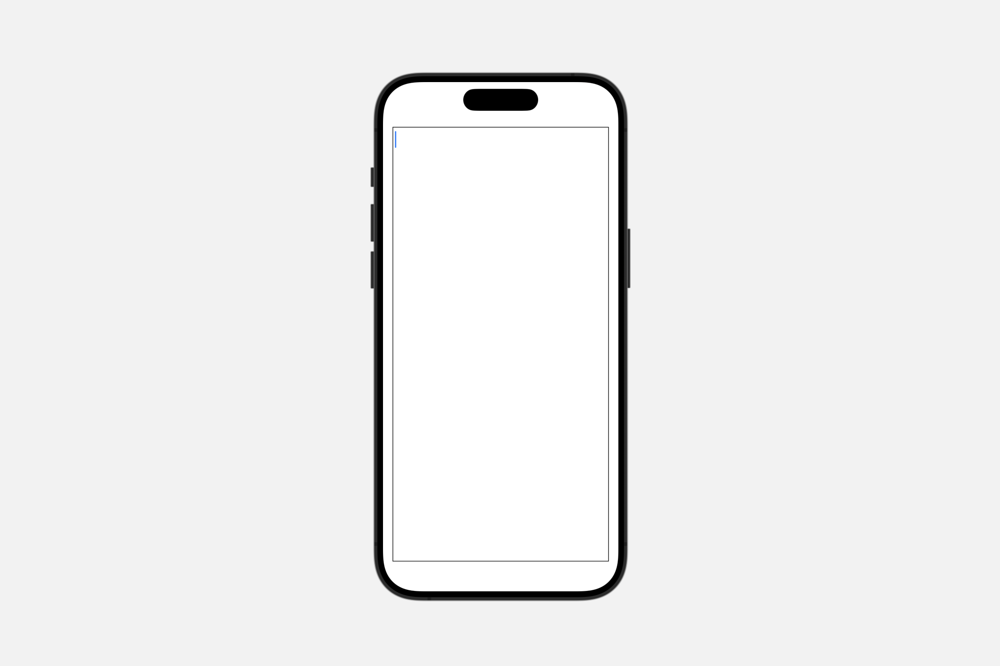


#### `roundedBorder` <Badge type="info" text="visionOS" />

一种带有系统定义圆角边框的文本编辑器样式。

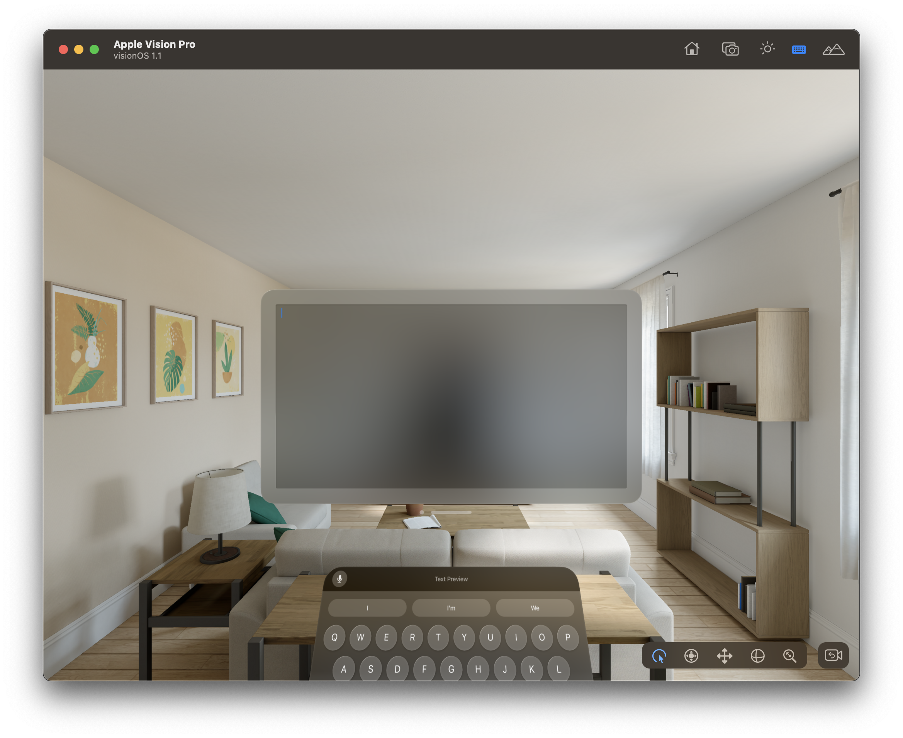

## Styling collection views

### `listStyle(_:)`

此操作为该视图中的列表设置样式。

```swift
func listStyle<S>(_ style: S) -> some View where S : ListStyle
```

#### `automatic`

描述平台对于列表的默认行为和外观的列表样式。

#### `bordered` <Badge type="tip" text="macOS" />

描述具有标准边框的列表的行为和外观的列表样式。

```swift
List{
    Toggle("开关", isOn: .constant(true))
    LabeledContent("备注", value: "列表")
}.listStyle(.bordered)
```

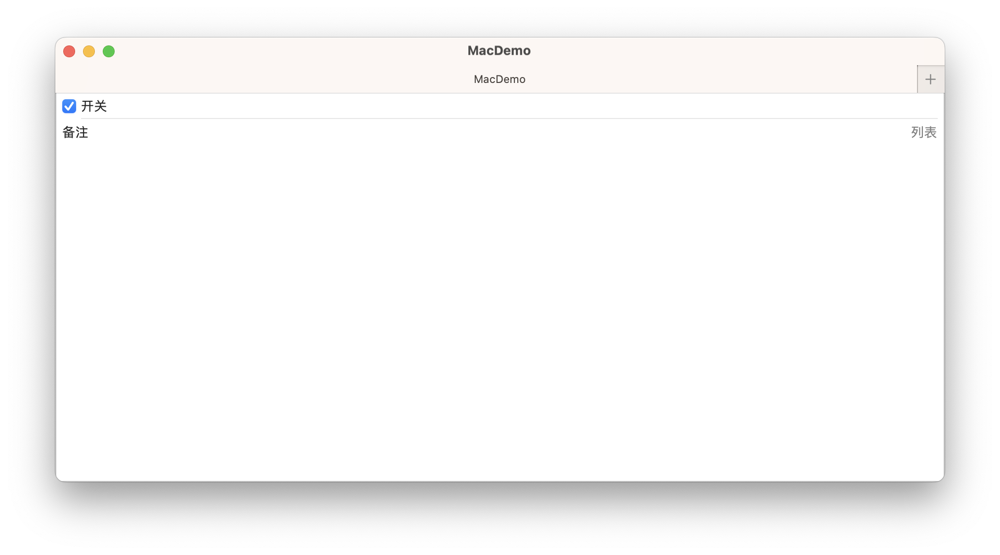


#### `carousel` <Badge type="warning" text="watchOS" />

轮播列表样式。


```swift
List{
    Toggle("开关", isOn: .constant(true))
    LabeledContent("信息", value: "5")
    LabeledContent("备注", value: "轮播")
    LabeledContent("设置", value: "空")
}.listStyle(.carousel)
```

<video src="../video/ListStyleCarousel.mp4" controls="controls"></video>


#### `elliptical` <Badge type="warning" text="watchOS" />

描述椭圆列表的行为和外观的列表样式。

```swift
List{
    Toggle("开关", isOn: .constant(true))
    LabeledContent("信息", value: "5")
    LabeledContent("备注", value: "椭圆列表")
    LabeledContent("设置", value: "空")
}.listStyle(.elliptical)
```

<video src="../video/ListStyleElliptical.mp4" controls="controls"></video>


#### `grouped`

描述分组列表的行为与外观的列表样式。

在 iOS 上，分组列表样式会显示比普通样式更大的标题和页脚，这在视觉上使不同部分的成员相互分开。

```swift
List{
    Toggle("开关", isOn: .constant(true))
    LabeledContent("信息", value: "5")
    LabeledContent("备注", value: "iOS")
    LabeledContent("设置", value: "空")
}.listStyle(.grouped)
```

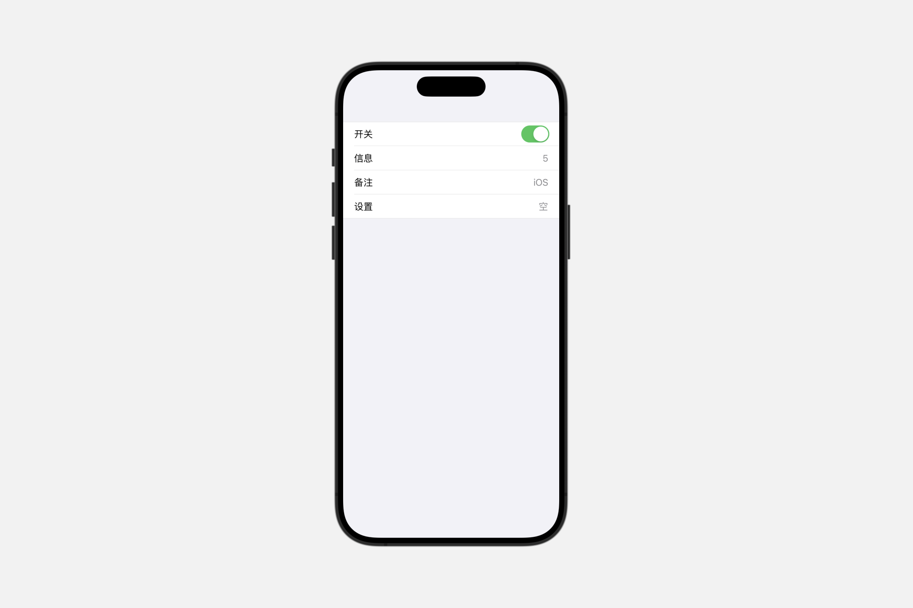


#### `inset`

描述嵌入式列表的行为与外观的列表样式。

```swift
List{
    Toggle("开关", isOn: .constant(true))
    LabeledContent("信息", value: "5")
    LabeledContent("备注", value: "iOS")
    LabeledContent("设置", value: "空")
}.listStyle(.inset)
```

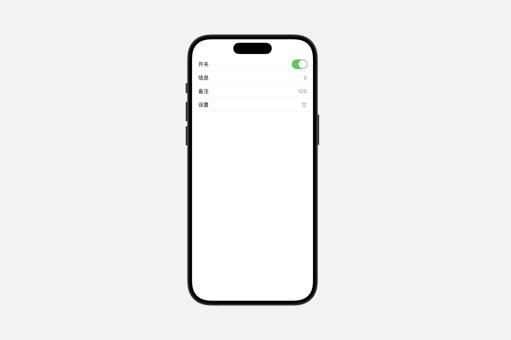


#### `insetGrouped`

描述嵌入式分组列表的行为与外观的列表样式。

在iOS上，嵌入式分组列表样式会显示一个连续的背景色，这个颜色从章节标题开始，环绕章节内列表项的两侧，并一直延伸到章节页脚。这种视觉效果比单独使用嵌入式或分组样式更能程度地将项目进行分组。

```swift
List{
    Toggle("开关", isOn: .constant(true))
    LabeledContent("信息", value: "5")
    LabeledContent("备注", value: "iOS")
    LabeledContent("设置", value: "空")
}.listStyle(.insetGrouped)
```

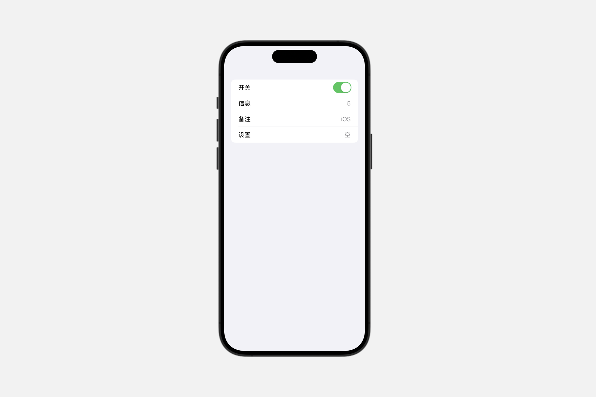


#### `plain`

描述简约列表的行为与外观的列表样式。

```swift
List{
    Toggle("开关", isOn: .constant(true))
    LabeledContent("信息", value: "5")
    LabeledContent("备注", value: "iOS")
    LabeledContent("设置", value: "空")
}.listStyle(.plain)
```


#### `sidebar`

描述侧边栏列表的行为与外观的列表样式。

在 macOS 和 iOS 上，侧边栏列表样式在章节标题中显示展开指示器，允许用户折叠和展开章节。


<video src="../video/ListStyleSidebar.mp4" controls="controls"></video>

### `tableStyle(_:)`


此操作为该视图中的表格设置样式。


```swift
func tableStyle<S>(_ style: S) -> some View where S : TableStyle
```

#### `automatic`

当前上下文中默认的表格样式。

#### `inset`

描述内容及其选择与表格边缘嵌入的表格的行为和外观的表格样式。

要自定义表格的行是否应交替其背景色，请使用 `alternatingRowBackgrounds(_:)` 方法。


```swift
struct ContentView: View {

    struct Person: Identifiable {
        let givenName: String
        let familyName: String
        let emailAddress: String
        let id = UUID()

        var fullName: String { givenName + " " + familyName }
    }

    @State private var people = [
        Person(givenName: "Juan", familyName: "Chavez", emailAddress: "juanchavez@icloud.com"),
        Person(givenName: "Mei", familyName: "Chen", emailAddress: "meichen@icloud.com"),
        Person(givenName: "Tom", familyName: "Clark", emailAddress: "tomclark@icloud.com"),
        Person(givenName: "Gita", familyName: "Kumar", emailAddress: "gitakumar@icloud.com")
    ]

    var body: some View {

        Table(people) {
            TableColumn("Given Name", value: \.givenName)
            TableColumn("Family Name", value: \.familyName)
            TableColumn("E-Mail Address", value: \.emailAddress)
        }.tableStyle(.inset).alternatingRowBackgrounds()
    }
}
```

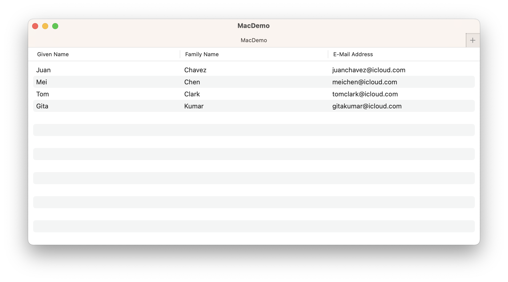


#### `bordered` <Badge type="tip" text="macOS" />

描述具有标准边框的表格的行为和外观的表格样式。

带边框的表格预期会与其外部容器缩进，但其行或选择不具备内嵌样式。

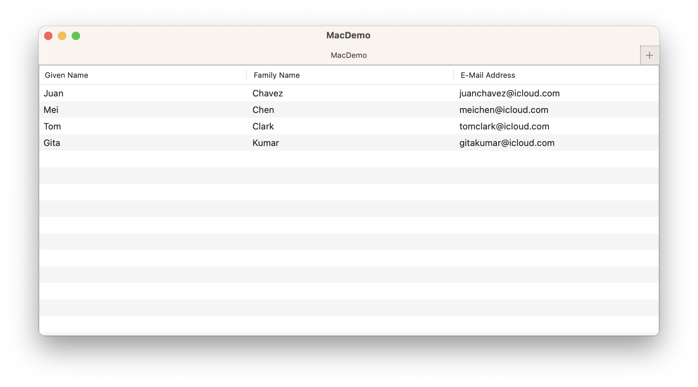

### `disclosureGroupStyle(_:)`

此操作为该视图中的 `DisclosureGroup` 设置样式。

```swift
func disclosureGroupStyle<S>(_ style: S) -> some View where S : DisclosureGroupStyle
```

```swift
struct ContentView: View {

    struct ToggleStates {
        var oneIsOn: Bool = false
        var twoIsOn: Bool = true
    }
    @State private var toggleStates = ToggleStates()
    @State private var topExpanded: Bool = true

    var body: some View {

        Form {
            DisclosureGroup("Items", isExpanded: $topExpanded) {
                Toggle("Toggle 1", isOn: $toggleStates.oneIsOn)
                Toggle("Toggle 2", isOn: $toggleStates.twoIsOn)
                DisclosureGroup("Sub-items") {
                    Text("Sub-item 1")
                }
            }
        }

    }
}
```

<video src="../video/DisclosureGroupStyle.mp4" controls="controls"></video>

#### Creating custom disclosure group styles


```swift
 Form {
    DisclosureGroup("Items", isExpanded: $topExpanded) {
        Toggle("Toggle 1", isOn: $toggleStates.oneIsOn)
        Toggle("Toggle 2", isOn: $toggleStates.twoIsOn)
        DisclosureGroup("Sub-items") {
            Text("Sub-item 1")
        }
    }.disclosureGroupStyle(MyDisclosureStyle())
}
```

```swift
struct MyDisclosureStyle: DisclosureGroupStyle {
    func makeBody(configuration: Configuration) -> some View {
        VStack {
            Button {
                withAnimation {
                    configuration.isExpanded.toggle()
                }
            } label: {
                HStack(alignment: .firstTextBaseline) {
                    configuration.label
                    Spacer()
                    Text(configuration.isExpanded ? "hide" : "show")
                        .foregroundColor(.accentColor)
                        .font(.caption.lowercaseSmallCaps())
                        .animation(nil, value: configuration.isExpanded)
                }
                .contentShape(Rectangle())
            }
            .buttonStyle(.plain)
            if configuration.isExpanded {
                configuration.content
            }
        }
    }
}
```

<video src="../video/DisclosureGroupStyleCustom.mp4" controls="controls"></video>


## Styling navigation views

### `navigationSplitViewStyle(_:)`

此操作为该视图中的导航分割视图设置样式。

```swift
func navigationSplitViewStyle<S>(_ style: S) -> some View where S : NavigationSplitViewStyle
```

#### `automatic`

一种根据当前上下文自动确定其外观的导航分割样式。

```swift
NavigationSplitView {
    Text("Sidebar")
} content: {
    Text("Content")
} detail: {
    Text("Detail")
}
.navigationSplitViewStyle(.automatic)
```

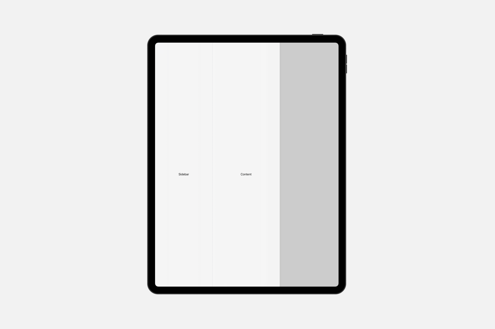

#### `balanced`

一种导航分割样式，当显示 `leading` 列或多列时，会减小详情内容的大小以腾出空间。

```swift
NavigationSplitView {
    Text("Sidebar")
} content: {
    Text("Content")
} detail: {
    Text("Detail")
}
.navigationSplitViewStyle(.balanced)
```

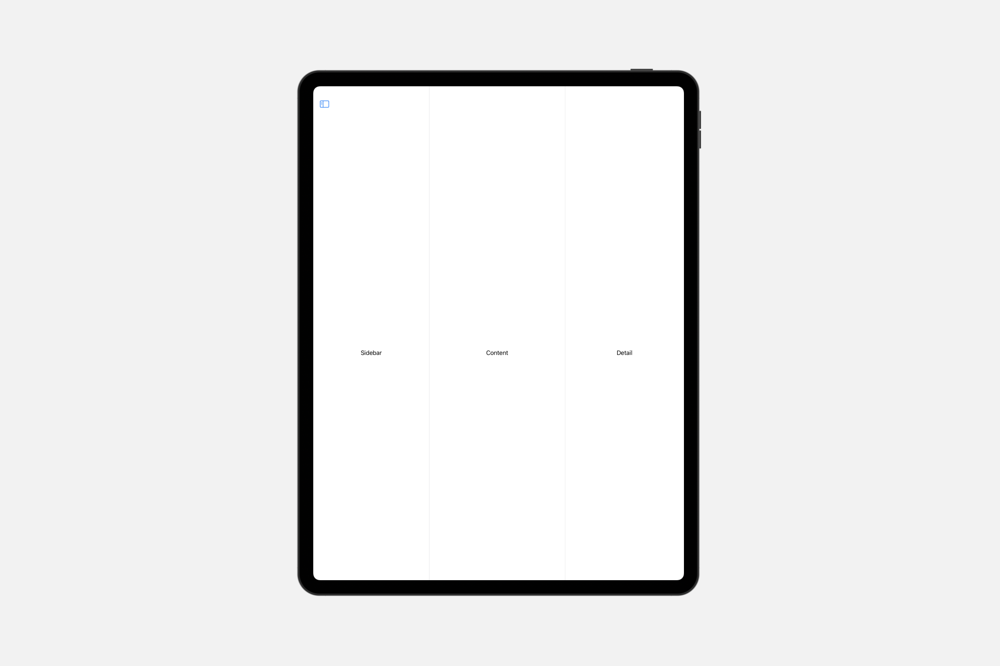


#### `prominentDetail`

一种导航分割样式，尝试在隐藏或显示 `leading` 列时保持详情内容的大小不变。


### `tabViewStyle(_:)`

此操作为当前环境中的标签视图设置样式。

```swift
func tabViewStyle<S>(_ style: S) -> some View where S : TabViewStyle
```

#### `automatic`

默认的 `TabView` 样式。

```swift
struct ContentView: View {

    var body: some View {
        TabView {

            List{
                LabeledContent("备注", value: "12345")
            }.tabItem {
                Label("首页", systemImage: "1.circle")
            }

            List{
                Toggle("开关", isOn: .constant(true))
            }.tabItem {
                Label("设置", systemImage: "gear")
            }

        }.tabViewStyle(.automatic)
    }
}
```
<video src="../video/TabViewStyleAutomatic.mp4" controls="controls"></video>

#### `page`

实现分页滚动的 `TabView` 样式。

```swift
TabView {
    Color.blue
    Color.yellow
}.tabViewStyle(.page)
```

<video src="../video/TabViewStylePage.mp4" controls="controls"></video>


#### `page(indexDisplayMode:)`

实现带有索引显示模式的分页滚动的 `TabView` 样式。

<video src="../video/TabViewStylePageIndex.mp4" controls="controls"></video>

```swift
TabView {
    Color.blue
    Color.yellow
}.tabViewStyle(.page(indexDisplayMode: .never))
```


#### `verticalPage` <Badge type="warning" text="watchOS" />

实现垂直页面交互和外观的 `TabView` 样式。

```swift
TabView {

    Color.blue
    Color.yellow
    Color.white

}.tabViewStyle(.verticalPage)
```
<video src="../video/TabViewStyleVerticalPage.mp4" controls="controls"></video>

#### `verticalPage(transitionStyle:)` <Badge type="warning" text="watchOS" />

```swift
TabView {

    Color.blue
    Color.yellow
    Color.white

}.tabViewStyle(.verticalPage(transitionStyle: .identity))
```
<video src="../video/TabViewStyleVerticalPageIdentity.mp4" controls="controls"></video>


## Styling groups

### `controlGroupStyle(_:)`

此操作为该视图中的控件组设置样式。

```swift
func controlGroupStyle<S>(_ style: S) -> some View where S : ControlGroupStyle
```

#### `automatic`

默认的控件组样式。

默认的控件组样式可能会因平台而异。默认情况下，两个平台都使用适合其渲染环境的瞬时分段控件样式。

你可以覆盖控件组的样式。要将默认样式应用于控件组或包含控件组的视图，请使用controlGroupStyle(_:)修饰符。

```swift

Menu {
    ControlGroup {
        Button("1", systemImage: "1.circle") {}
        Button("2", systemImage: "2.circle") {}
        Button("3", systemImage: "3.circle") {}
    }.controlGroupStyle(.automatic)
} label: {
    Label("菜单", systemImage: "checkmark")
}
```

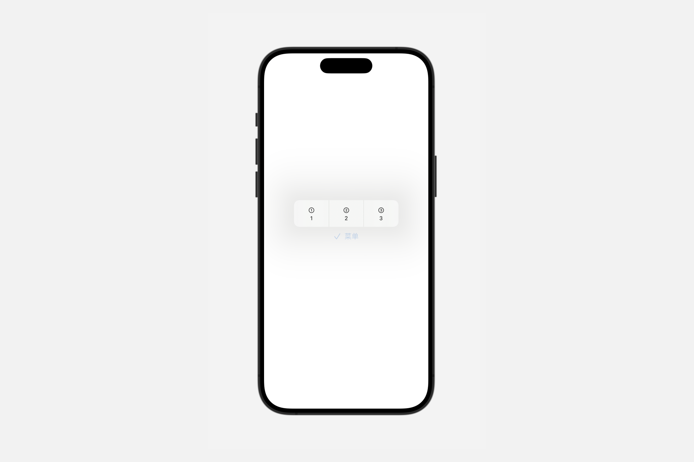

#### `compactMenu`

一种控件组样式，当用户按下控件时，以其内容呈现为紧凑型菜单；当嵌套在较大的菜单中时，则作为子菜单呈现。

```swift

Menu {
    ControlGroup {
        Button("1", systemImage: "1.circle") {}
        Button("2", systemImage: "2.circle") {}
        Button("3", systemImage: "3.circle") {}
    }.controlGroupStyle(.compactMenu)
} label: {
    Label("菜单", systemImage: "checkmark")
}
```

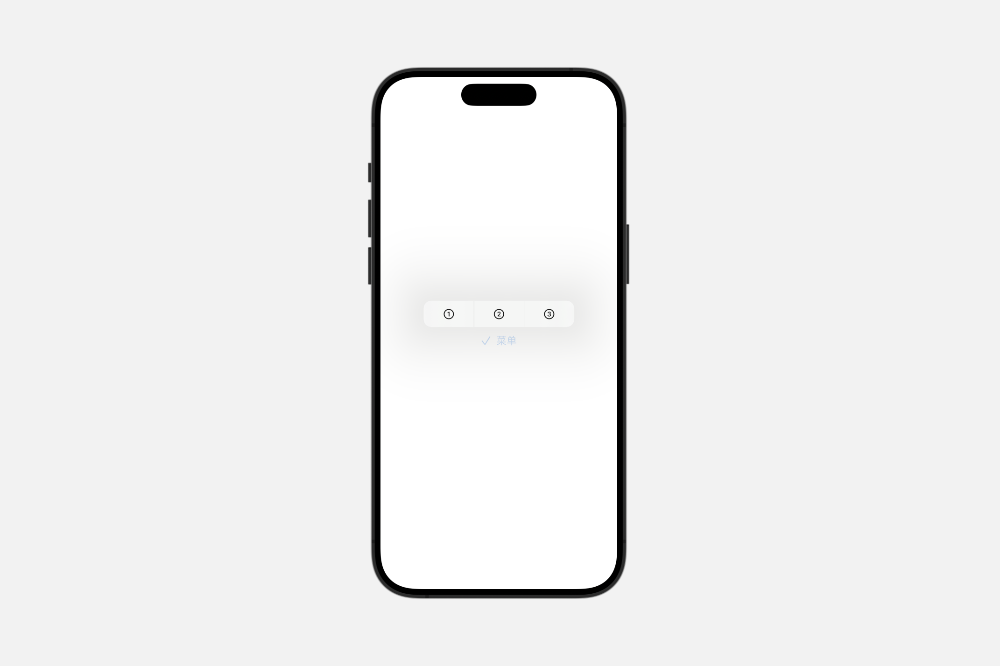


#### `menu`

一种控件组样式，当用户按下控件时，以其内容呈现为菜单；当嵌套在较大的菜单中时，则作为子菜单呈现。

```swift

Menu {
    ControlGroup {
        Button("1", systemImage: "1.circle") {}
        Button("2", systemImage: "2.circle") {}
        Button("3", systemImage: "3.circle") {}
    }.controlGroupStyle(.menu)
} label: {
    Label("菜单", systemImage: "checkmark")
}
```


#### `navigation`

使用此样式对与导航相关的控件进行分组，如前进/后退按钮或时间线导航控件。

导航控件组样式可能会根据平台有所不同。在 iOS 上，它呈现为无边框的独立按钮；而在 macOS 上，则显示为分隔的瞬时分段控件。

```swift

Menu {
    ControlGroup {
        Button("1", systemImage: "1.circle") {}
        Button("2", systemImage: "2.circle") {}
        Button("3", systemImage: "3.circle") {}
    }.controlGroupStyle(.navigation)
} label: {
    Label("菜单", systemImage: "checkmark")
}
```
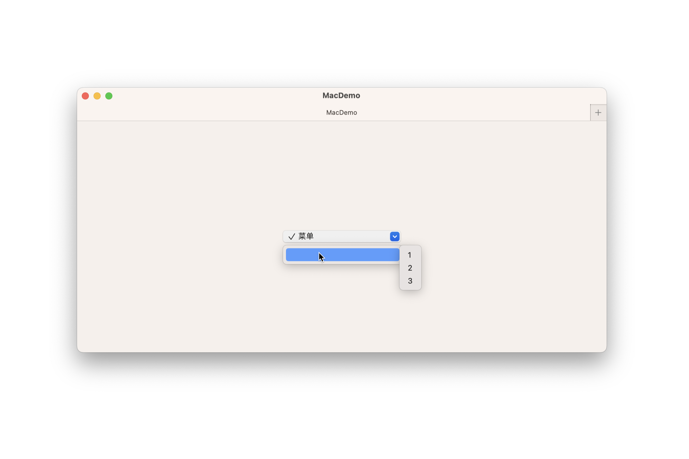


#### `palette`

一种控制组样式，以调色板的形式展示其内容。

::: info
当在菜单外部使用时，这种样式呈现为分段控件。
:::

使用此风格来渲染一个多选菜单或无状态调色板。下面的例子创建了一个控制组，该组同时包含了两种类型的组件：

```swift
struct ContentView: View {

    // 定义颜色标签的枚举
    enum ColorTags: CaseIterable {
        case red, orange, yellow, green, blue, purple

        var name: String {
            switch self {
            case .red:
                return "Red"
            case .orange:
                return "Orange"
            case .yellow:
                return "Yellow"
            case .green:
                return "Green"
            case .blue:
                return "Blue"
            case .purple:
                return "Purple"
            }
        }

        var color: Color {
            switch self {
            case .red:
                return .red
            case .orange:
                return .orange
            case .yellow:
                return .yellow
            case .green:
                return .green
            case .blue:
                return .blue
            case .purple:
                return .purple
            }
        }
    }

    // 定义表情符号的枚举
    enum Emotes: CaseIterable {
        case smile, wink, frown

        var name: String {
            switch self {
            case .smile:
                return "Smile"
            case .wink:
                return "Wink"
            case .frown:
                return "Frown"
            }
        }

        var systemImage: String {
            switch self {
            case .smile:
                return "face.smiling"
            case .wink:
                return "face.smiling.fill"
            case .frown:
                return "face.dashed"
            }
        }
    }

    @State var selectedColorTags: [ColorTags: Bool] = [.red: false, .orange: false, .yellow: false, .green: false, .blue: false, .purple: false]

    var body: some View {
        Menu("菜单") {
            // 多选调色板
            ControlGroup {
                ForEach(ColorTags.allCases, id: \.self) { colorTag in
                    Toggle(isOn: .constant(true)) {
                        Label(colorTag.name, systemImage: "circle")
                    }
                    .tint(colorTag.color)
                }
            }
            .controlGroupStyle(.palette)
            .paletteSelectionEffect(.symbolVariant(.fill))

            // 瞬时/无状态调色板
            ControlGroup {
                ForEach(Emotes.allCases, id: \.self) { emote in
                    Button {
                        sendEmote(emote)
                    } label: {
                        Label(emote.name, systemImage: emote.systemImage)
                    }
                }
            }
            .controlGroupStyle(.palette)
        }
    }

    // 发送表情符号的动作
    func sendEmote(_ emote: Emotes) {
        // 实现发送表情的逻辑
        print("Emote sent: \(emote.name)")
    }
}
```

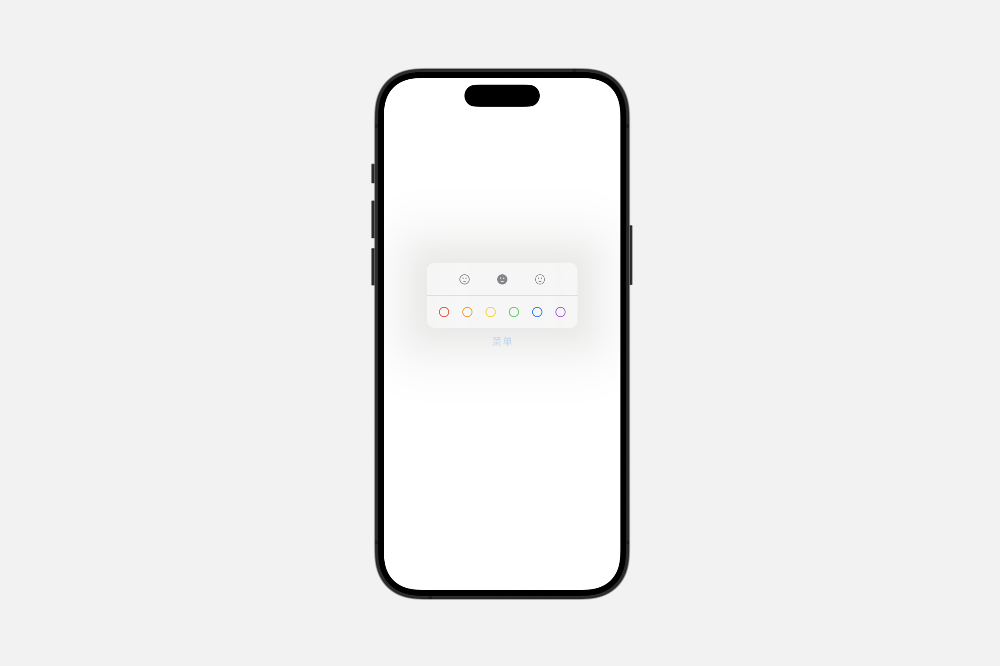


#### Creating custom control group styles

```swift
struct MyControlGroupStyle: ControlGroupStyle {
    func makeBody(configuration: Configuration) -> some View {
        VStack {
            configuration.label
            Divider()
            configuration.content
        }

    }
}
```

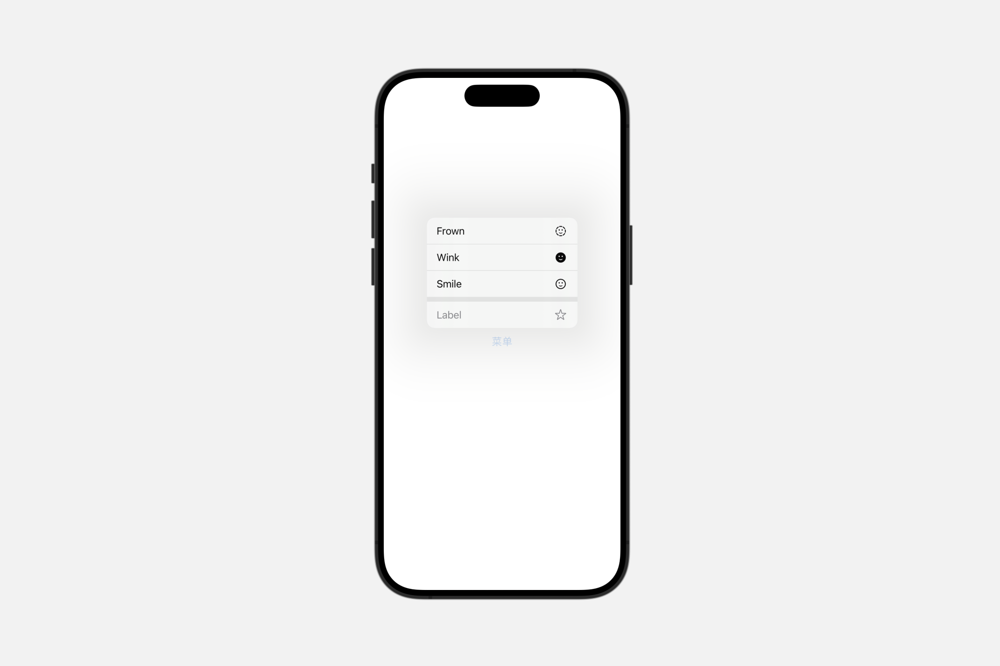