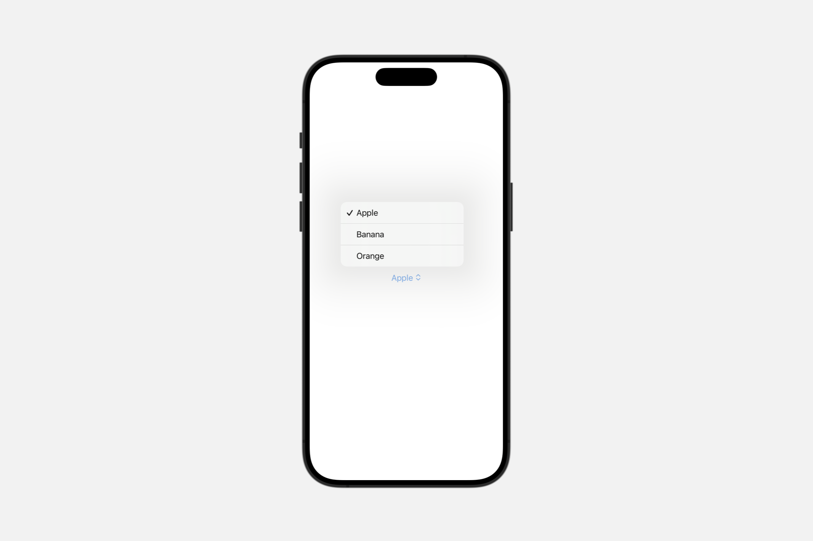

# View styles

为不同类型的视图应用内置和自定义外观及行为。

SwiftUI 为某些类型的视图定义了内置样式，并且会根据特定的展示环境自动选择合适的样式。例如，一个 `Label` 可能会根据不同的因素（如平台、是否出现在工具栏中等）表现为图标、字符串标题或两者兼有。

你可以使用风格视图修饰符之一来覆盖自动样式。这些修饰符通常在整个容器视图中传播，因此你可以将视图层次结构包裹在一个样式修饰符中，以影响层次结构中所有给定类型的视图。

任何定义了 `makeBody(configuration:)` 方法的风格协议，如 `ToggleStyle`，也使你能够定义自定义风格。创建一个遵循相应风格协议的类型并实现其 `makeBody(configuration:)` 方法。然后，像应用内置样式一样，使用样式视图修饰符应用新样式。


## Styling buttons

### `buttonStyle(_:)`

为该视图中的按钮设置样式，采用具有自定义外观和标准交互行为的按钮样式。

```swift
func buttonStyle<S>(_ style: S) -> some View where S : ButtonStyle
```

使用此修饰符为视图中的所有按钮实例设置特定的样式：

```swift
HStack {
    Button("Sign In", action: signIn)
    Button("Register", action: register)
}
.buttonStyle(.bordered)
```


你也可以使用此修饰符为通过组合获得按钮样式的控件设置样式，如下例中的 `Menu` 和 `Toggle` 视图：


`menuStyle(_:)` 修饰符使得“条款与条件”菜单呈现为按钮形式。类似地，`toggleStyle(_:)` 修饰符使得两个切换开关也呈现为按钮形式。然后，按钮样式修饰符不仅使明确的「登录」按钮，还包括具有按钮样式的菜单和切换开关，都以带边框的按钮样式呈现。

#### `role`

一个可选的语义角色，用于描述按钮的目的或功能。

```swift
let role: ButtonRole?
```

值为 `nil` 表示按钮没有分配角色。如果按钮确实有角色，请使用它来调整按钮的外观。以下示例展示了一种自定义样式，当角色为取消时使用粗体文本，在角色为破坏性时使用红色文本，否则不添加特殊样式：

```swift
struct MyButtonStyle: ButtonStyle {
    func makeBody(configuration: Configuration) -> some View {
        configuration.label
            .font(
                configuration.role == .cancel ? .title2.bold() : .title2)
            .foregroundColor(
                configuration.role == .destructive ? Color.red : nil)
    }
}
```


你可以使用此样式创建每种按钮的一个实例，以查看效果：

```swift
VStack(spacing: 20) {
    Button("Cancel", role: .cancel) {}
    Button("Delete", role: .destructive) {}
    Button("Continue") {}
}
.buttonStyle(MyButtonStyle())
```

### `PrimitiveButtonStyle`

一种类型，向视图层次结构中的所有按钮应用自定义交互行为和自定义外观。

```swift
protocol PrimitiveButtonStyle
```

要为视图层次结构配置当前的按钮样式，请使用 `buttonStyle(_:)` 修饰符。指定一个遵循 `PrimitiveButtonStyle` 的样式来创建具有自定义交互行为的按钮。要创建具有针对每个平台定义的标准按钮交互行为的按钮，请改用 `ButtonStyle`。


## Styling pickers

### `pickerStyle(_:)`

为该视图中的选择器设置样式。

```swift
func pickerStyle<S>(_ style: S) -> some View where S : PickerStyle
```

#### `automatic`

基于选择器上下文的默认选择器样式。

使用默认选择器样式的 `picker` 出现的方式在很大程度上取决于平台和其所处的视图类型。例如，在标准视图中，默认选择器样式按平台划分如下：

- 在 iOS 和 watchOS 上，默认是滚轮样式。
- 在 macOS 上，默认是弹出式按钮。
- 在 tvOS 上，默认是分段控制样式。

默认选择器样式在设置选择器外观时，也可能考虑其他因素，比如选择器是否出现在容器视图中。

你可以覆盖选择器的样式。若要将默认样式应用于选择器，或应用于包含选择器的视图，请使用 `pickerStyle(_:)` 修饰符。

```swift
Picker("选择", selection: $selection) {
    Text("Apple").tag(0)
    Text("Banana").tag(1)
    Text("Orange").tag(2)
}
```



#### `inline`

一种 `PickerStyle`，其中每个选项与当前容器中的其他视图并排显示。

```swift
Picker("选择", selection: $selection) {
    Text("Apple").tag(0)
    Text("Banana").tag(1)
    Text("Orange").tag(2)
}.pickerStyle(.inline)
```


#### `menu`

一种选择器样式，当用户按下按钮时，以菜单形式展示选项；或者在嵌套于更大菜单中时，以子菜单形式展示。

当有超过五个选项时，请使用此风格。如果选项少于五个，可以考虑使用内联样式。

按钮本身表示所选的选项。在选项集中，你可以包含额外的控制元素，比如用于自定义选项列表的按钮。

```swift
Picker("选择", selection: $selection) {
    Text("Apple").tag(0)
    Text("Banana").tag(1)
    Text("Orange").tag(2)
}.pickerStyle(.menu)
```


#### `navigationLink`

由导航链接表示的选择器样式，通过推送列表式选择器视图来展示选项。

在导航栈中，通常首选默认的菜单样式。但当你有大量的选项，或者你的设计通过推入堆栈表达得更好时，请考虑使用导航链接样式。

```swift
NavigationStack {
    Picker("选择", selection: $selection) {
        Text("Apple").tag(0)
        Text("Banana").tag(1)
        Text("Orange").tag(2)
    }.pickerStyle(.navigationLink)
        .padding()
}
```
<video src="../video/NavigationLink.mp4" controls="controls"></video>


#### `palette`

一种选择器样式，将选项以一排紧凑元素的形式展示。

::: warning 注意
在菜单外部使用时，此样式将以分段选择器的形式呈现。如果这是预期的用法，请考虑使用 `segmented` 样式代替。
:::

对于每个选项的标签，如果添加了超过 $6$ 个选项，请为每个项目使用一个符号。在 iOS 上，这样选择器会水平滚动。

以下示例创建了一个调色板选择器：

```swift
enum Reaction: Identifiable, CaseIterable {
    case thumbsup, thumbsdown, heart, questionMark
    var id: Self { self }
}

@State private var selection: Reaction? = .none

var body: some View {
    Menu("Reactions") {
        Picker("Palette", selection: $selection) {
            Label("Thumbs up", systemImage: "hand.thumbsup")
                .tag(Reaction.thumbsup)
            Label("Thumbs down", systemImage: "hand.thumbsdown")
                .tag(Reaction.thumbsdown)
            Label("Like", systemImage: "heart")
                .tag(Reaction.heart)
            Label("Question mark", systemImage: "questionmark")
                .tag(Reaction.questionMark)
        }
        .pickerStyle(.palette)
        Button("Reply...") { ... }
    }
}
```


调色板选择器会显示未着色的 SF Symbols 或模板图片，并应用系统着色。对于着色的 SF Symbols，在选择时会在符号周围描边。如果你希望提供特定的图像（或 SF Symbol ）来表示选择，我们建议使用 `custom` 样式。这将禁用任何系统选择行为，从而使提供的图像仅用来指示选择。

以下示例创建了一个调色板选择器，该选择器禁用了系统的选取行为：


```swift
Menu("Reactions") {
    Picker("Palettes", selection: $selection) {
        ForEach(palettes) { palette in
            Label(palette.title, systemImage: selection == palette.id ?
                "circle.dashed.inset.filled" : "circle.fill")
            .tint(palette.tint)
            .tag(palette.id)
        }
    }
    .pickerStyle(.palette)
    .paletteSelectionEffect(.custom)
Button("Reply...") { }
```

<video src="../video/PickerPaletteTint.mp4" controls="controls"></video>


如果更倾向于使用特定的 SF Symbol 变体，则使用 `symbolVariant(_:)`：

```swift
Menu("Reactions") {
    Picker("Flags", selection: $selection) {
        ForEach(palettes) { palette in
            Label(palette.title, systemImage: "flag")
                .tint(palette.tint)
                .tag(palette.id)
        }
    }
    .pickerStyle(.palette)
    .paletteSelectionEffect(.symbolVariant(.slash))
}
```
<video src="../video/PickerPaletteSymbolVariant.mp4" controls="controls"></video>


#### `radioGroup`  <Badge type="tip" text="macOS" />

一种选择器样式，将选项以一组单选按钮的形式展示。

```swift
static var radioGroup: RadioGroupPickerStyle { get }
```

当有两个至五个选项时，请使用此风格。如果有超过五个选项，请考虑使用菜单样式。

对于每个选项的标签，使用句式大写，不要结束标点，如句号或冒号。

<video src="../video/PickerRadioGroup.mp4" controls="controls"></video>


#### `segmented`


一种选择器样式，将选项以分段控制的方式展示。

当有两个到五个选项时，请使用此风格。如果选项多于五个，请考虑使用菜单样式。

对于每个选项的标签，使用句式大写，不添加结束标点，如句号或冒号。

<video src="../video/PickerSegmented.mp4" controls="controls"></video>

#### `wheel`

一种选择器样式，将选项显示在一个可滚动的轮盘中，轮盘上同时展示所选选项及其周围的几个相邻选项。

由于大部分选项不可见，因此请按可预测的顺序组织它们，例如按字母顺序。

<video src="../video/PickerWheel.mp4" controls="controls"></video>

