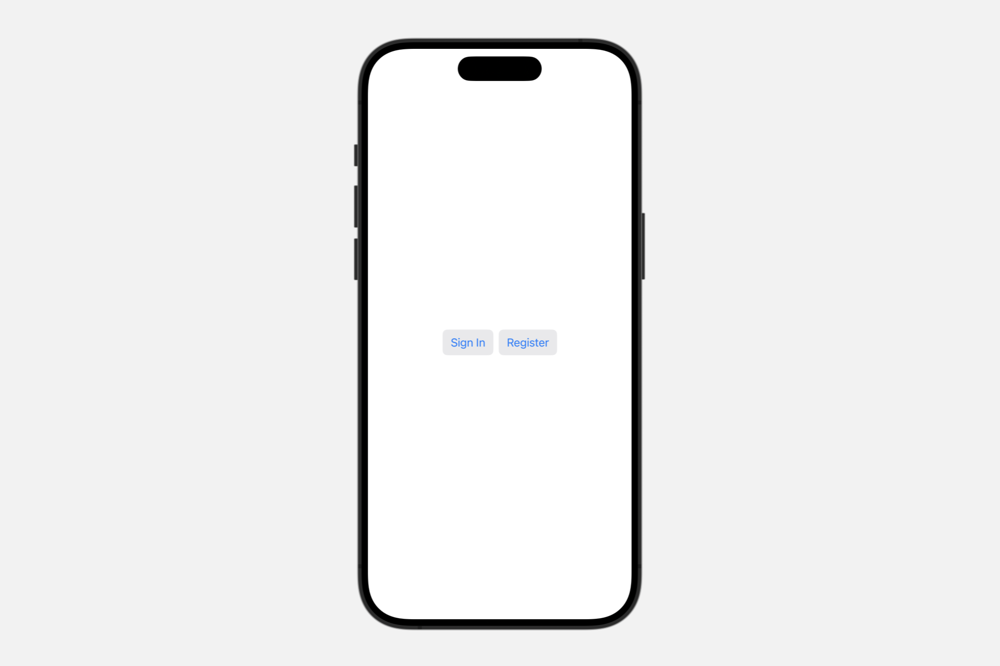
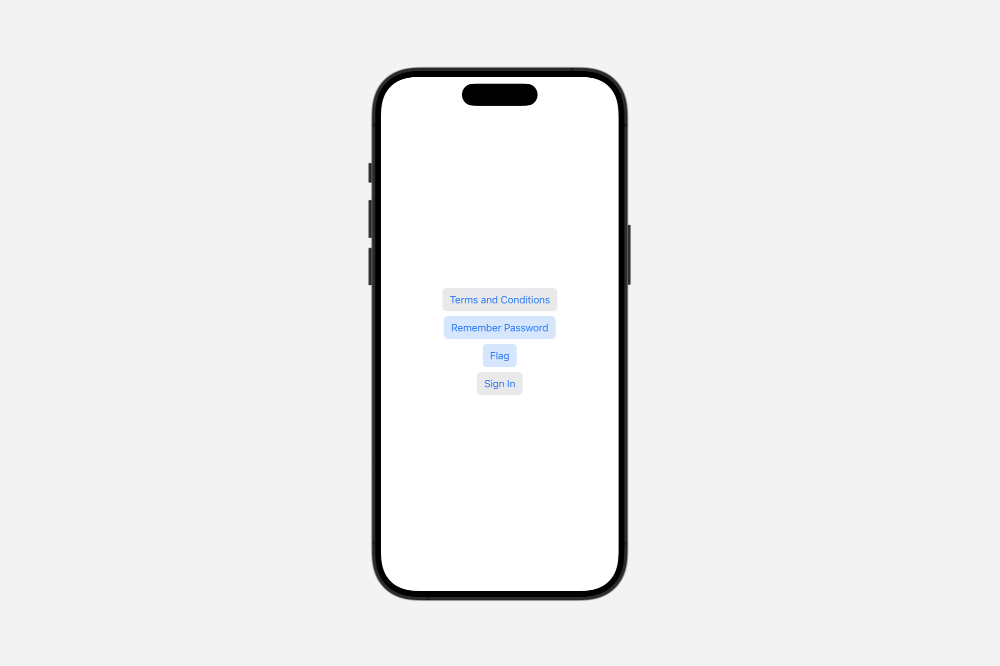

# Styling buttons

为不同类型的视图应用内置和自定义外观及行为。

SwiftUI 为某些类型的视图定义了内置样式，并且会根据特定的展示环境自动选择合适的样式。例如，一个 `Label` 可能会根据不同的因素（如平台、是否出现在工具栏中等）表现为图标、字符串标题或两者兼有。

你可以使用风格视图修饰符之一来覆盖自动样式。这些修饰符通常在整个容器视图中传播，因此你可以将视图层次结构包裹在一个样式修饰符中，以影响层次结构中所有给定类型的视图。

任何定义了 `makeBody(configuration:)` 方法的风格协议，如 `ToggleStyle`，也使你能够定义自定义风格。创建一个遵循相应风格协议的类型并实现其 `makeBody(configuration:)` 方法。然后，像应用内置样式一样，使用样式视图修饰符应用新样式。


## `buttonStyle(_:)`

为该视图中的按钮设置样式，采用具有自定义外观和标准交互行为的按钮样式。

```swift
func buttonStyle<S>(_ style: S) -> some View where S : ButtonStyle
```

使用此修饰符为视图中的所有按钮实例设置特定的样式：

```swift
HStack {
    Button("Sign In", action: signIn)
    Button("Register", action: register)
}
.buttonStyle(.bordered)
```



你也可以使用此修饰符为通过组合获得按钮样式的控件设置样式，如下例中的 `Menu` 和 `Toggle` 视图：



`menuStyle(_:)` 修饰符使得“条款与条件”菜单呈现为按钮形式。类似地，`toggleStyle(_:)` 修饰符使得两个切换开关也呈现为按钮形式。然后，按钮样式修饰符不仅使明确的「登录」按钮，还包括具有按钮样式的菜单和切换开关，都以带边框的按钮样式呈现。

### `role`

一个可选的语义角色，用于描述按钮的目的或功能。

```swift
let role: ButtonRole?
```

值为 `nil` 表示按钮没有分配角色。如果按钮确实有角色，请使用它来调整按钮的外观。以下示例展示了一种自定义样式，当角色为取消时使用粗体文本，在角色为破坏性时使用红色文本，否则不添加特殊样式：

```swift
struct MyButtonStyle: ButtonStyle {
    func makeBody(configuration: Configuration) -> some View {
        configuration.label
            .font(
                configuration.role == .cancel ? .title2.bold() : .title2)
            .foregroundColor(
                configuration.role == .destructive ? Color.red : nil)
    }
}
```


你可以使用此样式创建每种按钮的一个实例，以查看效果：

```swift
VStack(spacing: 20) {
    Button("Cancel", role: .cancel) {}
    Button("Delete", role: .destructive) {}
    Button("Continue") {}
}
.buttonStyle(MyButtonStyle())
```

## `PrimitiveButtonStyle`

一种类型，向视图层次结构中的所有按钮应用自定义交互行为和自定义外观。

```swift
protocol PrimitiveButtonStyle
```

要为视图层次结构配置当前的按钮样式，请使用 `buttonStyle(_:)` 修饰符。指定一个遵循 `PrimitiveButtonStyle` 的样式来创建具有自定义交互行为的按钮。要创建具有针对每个平台定义的标准按钮交互行为的按钮，请改用 `ButtonStyle`。
