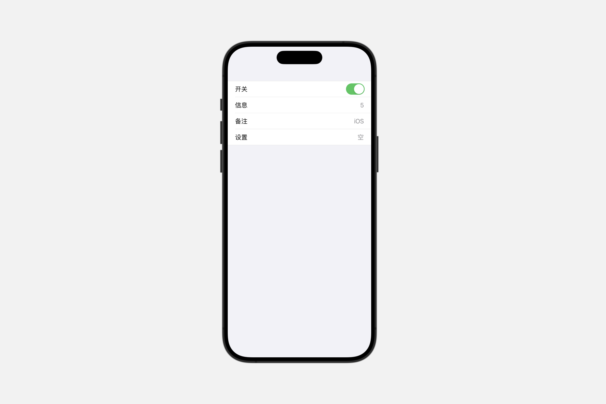
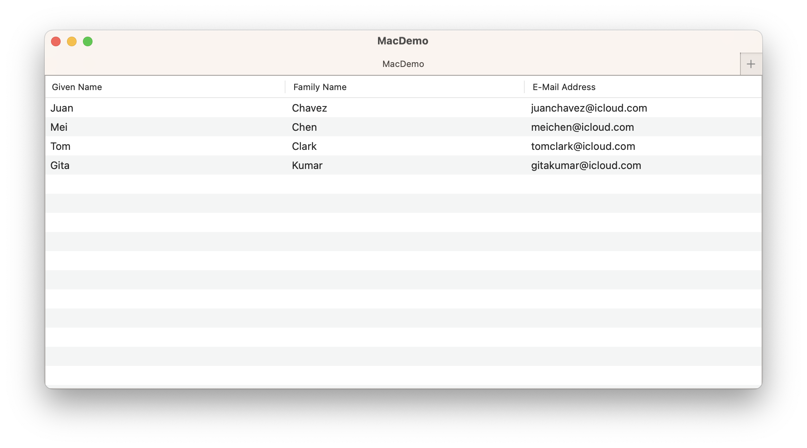

# Styling collection views

## `listStyle(_:)`

此操作为该视图中的列表设置样式。

```swift
func listStyle<S>(_ style: S) -> some View where S : ListStyle
```

### `automatic`

描述平台对于列表的默认行为和外观的列表样式。

### `bordered` <Badge type="tip" text="macOS" />

描述具有标准边框的列表的行为和外观的列表样式。

```swift
List{
    Toggle("开关", isOn: .constant(true))
    LabeledContent("备注", value: "列表")
}.listStyle(.bordered)
```


### `carousel` <Badge type="warning" text="watchOS" />

轮播列表样式。


```swift
List{
    Toggle("开关", isOn: .constant(true))
    LabeledContent("信息", value: "5")
    LabeledContent("备注", value: "轮播")
    LabeledContent("设置", value: "空")
}.listStyle(.carousel)
```

<video src="../../video/ListStyleCarousel.mp4" controls="controls"></video>


### `elliptical` <Badge type="warning" text="watchOS" />

描述椭圆列表的行为和外观的列表样式。

```swift
List{
    Toggle("开关", isOn: .constant(true))
    LabeledContent("信息", value: "5")
    LabeledContent("备注", value: "椭圆列表")
    LabeledContent("设置", value: "空")
}.listStyle(.elliptical)
```

<video src="../../video/ListStyleElliptical.mp4" controls="controls"></video>


### `grouped`

描述分组列表的行为与外观的列表样式。

在 iOS 上，分组列表样式会显示比普通样式更大的标题和页脚，这在视觉上使不同部分的成员相互分开。

```swift
List{
    Toggle("开关", isOn: .constant(true))
    LabeledContent("信息", value: "5")
    LabeledContent("备注", value: "iOS")
    LabeledContent("设置", value: "空")
}.listStyle(.grouped)
```




### `inset`

描述嵌入式列表的行为与外观的列表样式。

```swift
List{
    Toggle("开关", isOn: .constant(true))
    LabeledContent("信息", value: "5")
    LabeledContent("备注", value: "iOS")
    LabeledContent("设置", value: "空")
}.listStyle(.inset)
```


### `insetGrouped`

描述嵌入式分组列表的行为与外观的列表样式。

在iOS上，嵌入式分组列表样式会显示一个连续的背景色，这个颜色从章节标题开始，环绕章节内列表项的两侧，并一直延伸到章节页脚。这种视觉效果比单独使用嵌入式或分组样式更能程度地将项目进行分组。

```swift
List{
    Toggle("开关", isOn: .constant(true))
    LabeledContent("信息", value: "5")
    LabeledContent("备注", value: "iOS")
    LabeledContent("设置", value: "空")
}.listStyle(.insetGrouped)
```


### `plain`

描述简约列表的行为与外观的列表样式。

```swift
List{
    Toggle("开关", isOn: .constant(true))
    LabeledContent("信息", value: "5")
    LabeledContent("备注", value: "iOS")
    LabeledContent("设置", value: "空")
}.listStyle(.plain)
```


### `sidebar`

描述侧边栏列表的行为与外观的列表样式。

在 macOS 和 iOS 上，侧边栏列表样式在章节标题中显示展开指示器，允许用户折叠和展开章节。


<video src="../../video/ListStyleSidebar.mp4" controls="controls"></video>

## `tableStyle(_:)`


此操作为该视图中的表格设置样式。


```swift
func tableStyle<S>(_ style: S) -> some View where S : TableStyle
```

### `automatic`

当前上下文中默认的表格样式。

### `inset`

描述内容及其选择与表格边缘嵌入的表格的行为和外观的表格样式。

要自定义表格的行是否应交替其背景色，请使用 `alternatingRowBackgrounds(_:)` 方法。


```swift
struct ContentView: View {

    struct Person: Identifiable {
        let givenName: String
        let familyName: String
        let emailAddress: String
        let id = UUID()

        var fullName: String { givenName + " " + familyName }
    }

    @State private var people = [
        Person(givenName: "Juan", familyName: "Chavez", emailAddress: "juanchavez@icloud.com"),
        Person(givenName: "Mei", familyName: "Chen", emailAddress: "meichen@icloud.com"),
        Person(givenName: "Tom", familyName: "Clark", emailAddress: "tomclark@icloud.com"),
        Person(givenName: "Gita", familyName: "Kumar", emailAddress: "gitakumar@icloud.com")
    ]

    var body: some View {

        Table(people) {
            TableColumn("Given Name", value: \.givenName)
            TableColumn("Family Name", value: \.familyName)
            TableColumn("E-Mail Address", value: \.emailAddress)
        }.tableStyle(.inset).alternatingRowBackgrounds()
    }
}
```


### `bordered` <Badge type="tip" text="macOS" />

描述具有标准边框的表格的行为和外观的表格样式。

带边框的表格预期会与其外部容器缩进，但其行或选择不具备内嵌样式。



### `disclosureGroupStyle(_:)`

此操作为该视图中的 `DisclosureGroup` 设置样式。

```swift
func disclosureGroupStyle<S>(_ style: S) -> some View where S : DisclosureGroupStyle
```

```swift
struct ContentView: View {

    struct ToggleStates {
        var oneIsOn: Bool = false
        var twoIsOn: Bool = true
    }
    @State private var toggleStates = ToggleStates()
    @State private var topExpanded: Bool = true

    var body: some View {

        Form {
            DisclosureGroup("Items", isExpanded: $topExpanded) {
                Toggle("Toggle 1", isOn: $toggleStates.oneIsOn)
                Toggle("Toggle 2", isOn: $toggleStates.twoIsOn)
                DisclosureGroup("Sub-items") {
                    Text("Sub-item 1")
                }
            }
        }

    }
}
```

<video src="../../video/DisclosureGroupStyle.mp4" controls="controls"></video>

### Creating custom disclosure group styles


```swift
Form {
    DisclosureGroup("Items", isExpanded: $topExpanded) {
        Toggle("Toggle 1", isOn: $toggleStates.oneIsOn)
        Toggle("Toggle 2", isOn: $toggleStates.twoIsOn)
        DisclosureGroup("Sub-items") {
            Text("Sub-item 1")
        }
    }.disclosureGroupStyle(MyDisclosureStyle())
}
```

```swift
struct MyDisclosureStyle: DisclosureGroupStyle {
    func makeBody(configuration: Configuration) -> some View {
        VStack {
            Button {
                withAnimation {
                    configuration.isExpanded.toggle()
                }
            } label: {
                HStack(alignment: .firstTextBaseline) {
                    configuration.label
                    Spacer()
                    Text(configuration.isExpanded ? "hide" : "show")
                        .foregroundColor(.accentColor)
                        .font(.caption.lowercaseSmallCaps())
                        .animation(nil, value: configuration.isExpanded)
                }
                .contentShape(Rectangle())
            }
            .buttonStyle(.plain)
            if configuration.isExpanded {
                configuration.content
            }
        }
    }
}
```

<video src="../../video/DisclosureGroupStyleCustom.mp4" controls="controls"></video>