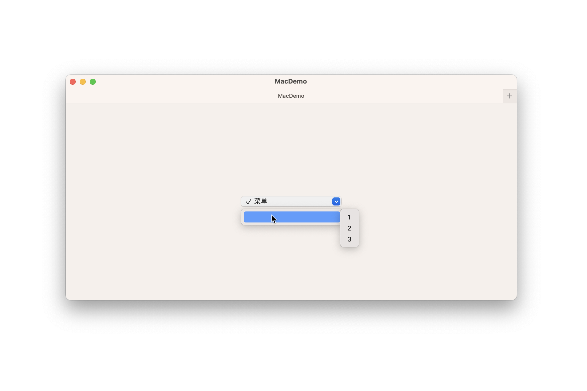
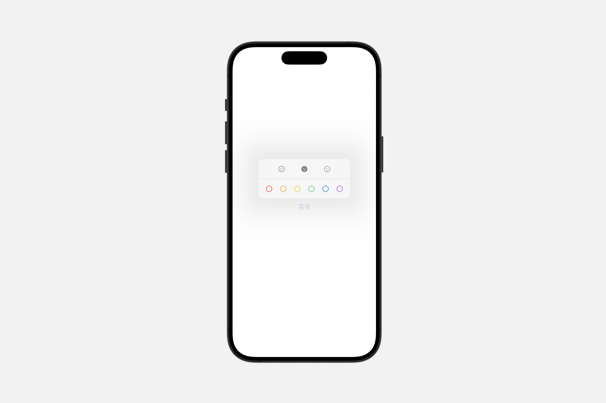
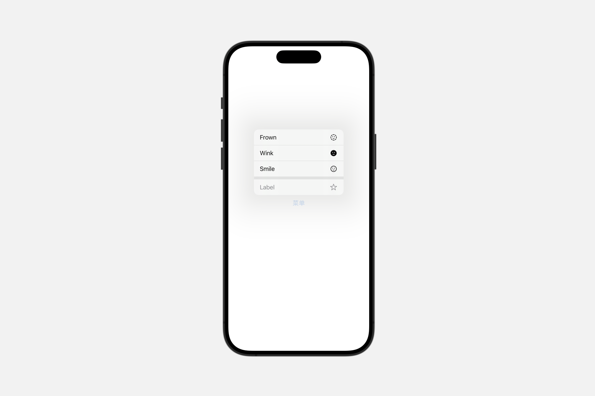

# Styling groups

## `controlGroupStyle(_:)`

此操作为该视图中的控件组设置样式。

```swift
func controlGroupStyle<S>(_ style: S) -> some View where S : ControlGroupStyle
```

### `automatic`

默认的控件组样式。

默认的控件组样式可能会因平台而异。默认情况下，两个平台都使用适合其渲染环境的瞬时分段控件样式。

你可以覆盖控件组的样式。要将默认样式应用于控件组或包含控件组的视图，请使用controlGroupStyle(_:)修饰符。

```swift

Menu {
    ControlGroup {
        Button("1", systemImage: "1.circle") {}
        Button("2", systemImage: "2.circle") {}
        Button("3", systemImage: "3.circle") {}
    }.controlGroupStyle(.automatic)
} label: {
    Label("菜单", systemImage: "checkmark")
}
```


### `compactMenu`

一种控件组样式，当用户按下控件时，以其内容呈现为紧凑型菜单；当嵌套在较大的菜单中时，则作为子菜单呈现。

```swift

Menu {
    ControlGroup {
        Button("1", systemImage: "1.circle") {}
        Button("2", systemImage: "2.circle") {}
        Button("3", systemImage: "3.circle") {}
    }.controlGroupStyle(.compactMenu)
} label: {
    Label("菜单", systemImage: "checkmark")
}
```


### `menu`

一种控件组样式，当用户按下控件时，以其内容呈现为菜单；当嵌套在较大的菜单中时，则作为子菜单呈现。

```swift

Menu {
    ControlGroup {
        Button("1", systemImage: "1.circle") {}
        Button("2", systemImage: "2.circle") {}
        Button("3", systemImage: "3.circle") {}
    }.controlGroupStyle(.menu)
} label: {
    Label("菜单", systemImage: "checkmark")
}
```


### `navigation`

使用此样式对与导航相关的控件进行分组，如前进/后退按钮或时间线导航控件。

导航控件组样式可能会根据平台有所不同。在 iOS 上，它呈现为无边框的独立按钮；而在 macOS 上，则显示为分隔的瞬时分段控件。

```swift

Menu {
    ControlGroup {
        Button("1", systemImage: "1.circle") {}
        Button("2", systemImage: "2.circle") {}
        Button("3", systemImage: "3.circle") {}
    }.controlGroupStyle(.navigation)
} label: {
    Label("菜单", systemImage: "checkmark")
}
```



### `palette`

一种控制组样式，以调色板的形式展示其内容。

::: info
当在菜单外部使用时，这种样式呈现为分段控件。
:::

使用此风格来渲染一个多选菜单或无状态调色板。下面的例子创建了一个控制组，该组同时包含了两种类型的组件：

```swift
struct ContentView: View {

    // 定义颜色标签的枚举
    enum ColorTags: CaseIterable {
        case red, orange, yellow, green, blue, purple

        var name: String {
            switch self {
            case .red:
                return "Red"
            case .orange:
                return "Orange"
            case .yellow:
                return "Yellow"
            case .green:
                return "Green"
            case .blue:
                return "Blue"
            case .purple:
                return "Purple"
            }
        }

        var color: Color {
            switch self {
            case .red:
                return .red
            case .orange:
                return .orange
            case .yellow:
                return .yellow
            case .green:
                return .green
            case .blue:
                return .blue
            case .purple:
                return .purple
            }
        }
    }

    // 定义表情符号的枚举
    enum Emotes: CaseIterable {
        case smile, wink, frown

        var name: String {
            switch self {
            case .smile:
                return "Smile"
            case .wink:
                return "Wink"
            case .frown:
                return "Frown"
            }
        }

        var systemImage: String {
            switch self {
            case .smile:
                return "face.smiling"
            case .wink:
                return "face.smiling.fill"
            case .frown:
                return "face.dashed"
            }
        }
    }

    @State var selectedColorTags: [ColorTags: Bool] = [.red: false, .orange: false, .yellow: false, .green: false, .blue: false, .purple: false]

    var body: some View {
        Menu("菜单") {
            // 多选调色板
            ControlGroup {
                ForEach(ColorTags.allCases, id: \.self) { colorTag in
                    Toggle(isOn: .constant(true)) {
                        Label(colorTag.name, systemImage: "circle")
                    }
                    .tint(colorTag.color)
                }
            }
            .controlGroupStyle(.palette)
            .paletteSelectionEffect(.symbolVariant(.fill))

            // 瞬时/无状态调色板
            ControlGroup {
                ForEach(Emotes.allCases, id: \.self) { emote in
                    Button {
                        sendEmote(emote)
                    } label: {
                        Label(emote.name, systemImage: emote.systemImage)
                    }
                }
            }
            .controlGroupStyle(.palette)
        }
    }

    // 发送表情符号的动作
    func sendEmote(_ emote: Emotes) {
        // 实现发送表情的逻辑
        print("Emote sent: \(emote.name)")
    }
}
```




### Creating custom control group styles

```swift
struct MyControlGroupStyle: ControlGroupStyle {
    func makeBody(configuration: Configuration) -> some View {
        VStack {
            configuration.label
            Divider()
            configuration.content
        }

    }
}
```




## `formStyle(_:)`

为视图层次结构中的表单设置样式。


```swift
func formStyle<S>(_ style: S) -> some View where S : FormStyle
```

### `automatic`

```swift
Form {
    Toggle("开关", isOn: .constant(true))
    LabeledContent("备注", value: "123456")
}.formStyle(.automatic)
```


### `columns`

一种非滚动的表单样式，其中标签列与值列并排显示，标签列靠右对齐，值列靠左对齐。

```swift
Form {
    Toggle("开关", isOn: .constant(true))
    LabeledContent("备注", value: "123456")
}.formStyle(.columns)
```


### `grouped`

一种具有分组行的表单样式。

```swift
Form {
    Toggle("开关", isOn: .constant(true))
    LabeledContent("备注", value: "123456")
}.formStyle(.grouped)
```


### Creating custom form styles

```swift
struct MyFormStyle: FormStyle {
    func makeBody(configuration: Configuration) -> some View {
        configuration.content
            .padding()
            .background(.linearGradient(colors: [.blue, .green, .white], startPoint: .topLeading, endPoint: .bottomTrailing))

    }
}
```


## `groupBoxStyle(_:)`

此操作为在该视图中设置组合框的样式。


```swift
GroupBox(label:
    Label("End-User Agreement", systemImage: "building.columns")
    ) {
        ScrollView(.vertical, showsIndicators: true) {
            Text(agreementText)
                .font(.footnote)
        }
        .frame(height: 100)
        Toggle(isOn: $userAgreed) {
            Text("I agree to the above terms")
        }
}.padding()
```


### Creating custom group box styles

```swift
struct MyGroupBoxStyle: GroupBoxStyle {
    func makeBody(configuration: Configuration) -> some View {

        VStack {
            configuration.label
            configuration.content
        }.padding().background(.linearGradient(colors: [.blue, .green, .white], startPoint: .topLeading, endPoint: .bottomTrailing), in: .rect(cornerRadius: 25))
    }
}
```


## `labeledContentStyle(_:)`

此操作用于设置带有标签内容的样式。

```swift
func labeledContentStyle<S>(_ style: S) -> some View where S : LabeledContentStyle
```

### Creating custom labeled content styles

```swift
struct MyLabeledContentStyle: LabeledContentStyle {
    func makeBody(configuration: Configuration) -> some View {

        HStack {
            configuration.label.bold()
            Spacer()
            configuration.content.fontWeight(.heavy)
                .foregroundStyle(.linearGradient(colors: [.green, .blue,  .orange], startPoint: .topLeading, endPoint: .bottomTrailing))
                .underline()
        }

    }
}
```


