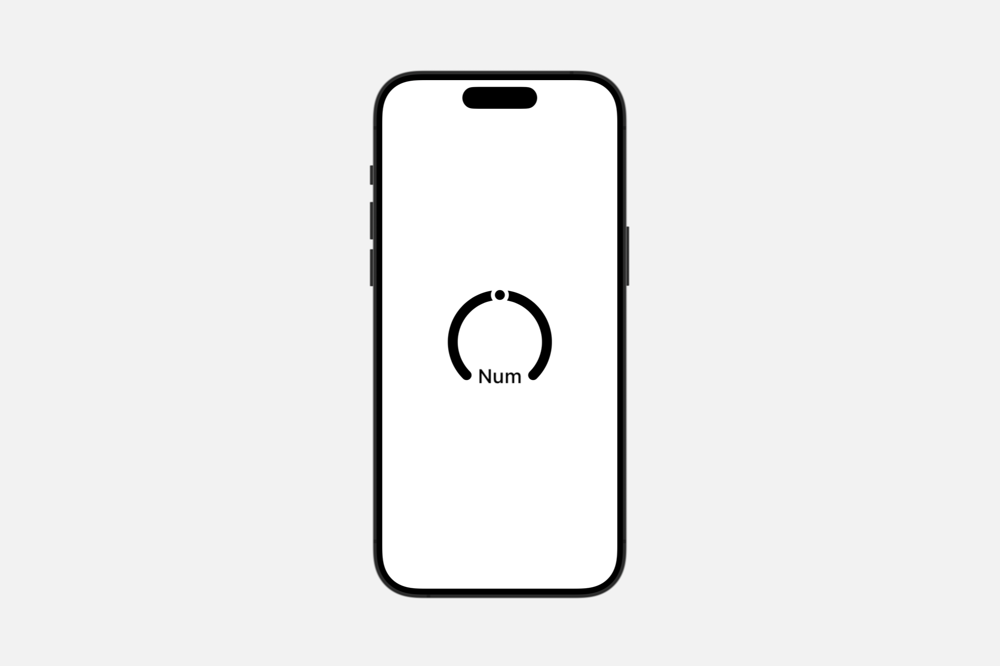
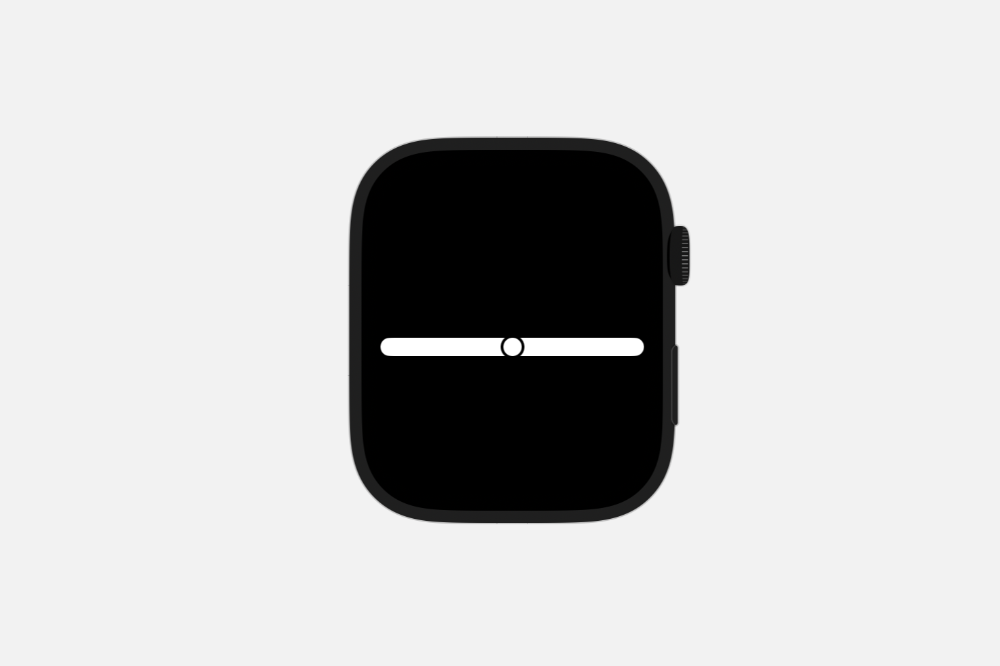
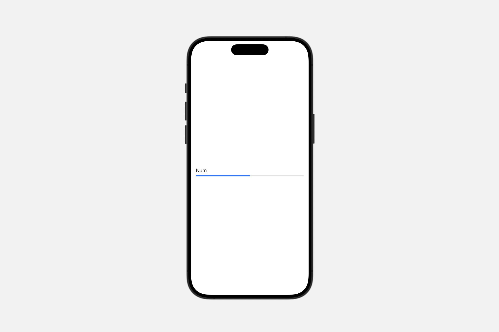
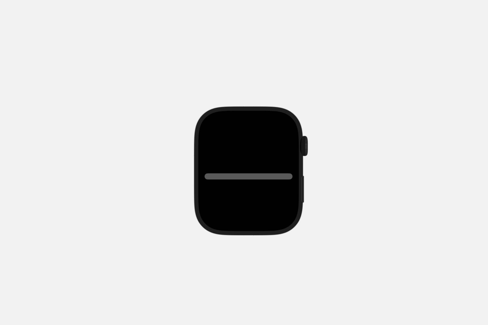

# Styling indicators

## `gaugeStyle(_:)`

为此视图中的仪表设置样式。

```swift
func gaugeStyle<S>(_ style: S) -> some View where S : GaugeStyle
```

### `circular` <Badge type="tip" text="watchOS" />

一种仪表样式，显示一个开放式环形，并带有一个标记，该标记出现在环上的某一点以指示仪表的当前值。

```swift
Gauge(value: batteryLevel, in: 0...100) {
    Text("Num")
}
.gaugeStyle(.circular)
```


此样式在仪表中心显示仪表的 `currentValueLabel` 值。如果在创建仪表时提供了 `minimumValueLabel` 和 `maximumValueLabel` 参数，它们将出现在环底部的开口处。否则，仪表会将其标签放置在该位置。


### `accessoryCircular`

这是一种仪表样式，展示了一个开放式环，并带有一个标记，该标记沿着环出现在某个点上以指示仪表的当前值。

```swift
Gauge(value: batteryLevel, in: 0...100) {
    Text("Num")
}
.gaugeStyle(.accessoryCircular)
```



此样式将仪表的 `currentValueLabel` 值显示在仪表的中心。如果你在创建仪表时提供了 `minimumValueLabel` 和 `maximumValueLabel` 参数，它们将出现在环底部的开口处。如果没有提供，仪表则会将其标签放置在那个位置。


### `accessoryCircularCapacity`

这是一种仪表样式，显示一个闭合的环，并部分填充以指示仪表的当前值。

```swift
Gauge(value: batteryLevel, in: 0...100) {
    Text("Num")
}
.gaugeStyle(.accessoryCircularCapacity)
```


这种风格在仪表的中心显示当前值标签 `currentValueLabel`，以便直观地展示仪表所代表的数据的即时状态。

### `linear` <Badge type="tip" text="watchOS" />

一种仪表盘样式，显示一条带有标记的条形，该标记出现在条形上的某个点，以指示仪表盘的当前值。

```swift
Gauge(value: batteryLevel, in: 0...100) {
    Text("Num")
}
.gaugeStyle(.linear)
```



如果你在创建仪表盘时提供了 `minimumValueLabel` 和 `maximumValueLabel` 参数，它们将分别出现在条形的前端和后端。否则，仪表盘将在前端显示 `currentValueLabel` 的值。


### `linearCapacity`

一种仪表盘样式，其中的条形会随着仪表盘当前值的增加而从前端向后端填充。

```swift
Gauge(value: batteryLevel, in: 0...100) {
    Text("Num")
}
.gaugeStyle(.linearCapacity)
```


如果你在创建仪表盘时提供了 `minimumValueLabel` 和 `maximumValueLabel` 参数，它们将分别出现在条形的前端和后端。标签显示在仪表盘的上方，而 `currentValueLabel` 则显示在下方。


### `accessoryLinear`

一种仪表盘样式，展示一根条形，并在其上某一点出现一个标记，以此来指示仪表盘的当前值。

```swift
Gauge(value: batteryLevel, in: 0...100) {
    Text("Num")
}
.gaugeStyle(.accessoryLinear)
```


如果在创建仪表盘时提供了 `minimumValueLabel` 和 `maximumValueLabel` 参数，它们将分别显示在条形的起始端和结束端。如果没有提供这些参数，则仪表盘会在起始端显示 `currentValueLabel` 的值。


### `accessoryLinearCapacity`

一种仪表盘样式，其特点是条形会随着仪表盘当前值的增加而从一端（起始端）向另一端（结束端）填充。

```swift
Gauge(value: batteryLevel, in: 0...100) {
    Text("Num")
}
.gaugeStyle(.accessoryLinearCapacity)
```



如果在创建仪表盘时提供了 `minimumValueLabel` 和 `maximumValueLabel` 参数，它们将分别显示在条形的前端和后端。标签显示在仪表盘的上方，而 `currentValueLabel`（当前值标签）则显示在下方。


## `progressViewStyle(_:)`

为视图中的进度视图设置样式。

```swift
func progressViewStyle<S>(_ style: S) -> some View where S : ProgressViewStyle
```

### `automatic`

在被设置样式的视图当前上下文中，默认的进度视图样式。

默认样式代表了基于进度视图最初初始化参数以及在视图层次结构中进度视图上下文的推荐样式。

```swift
ProgressView()
    .progressViewStyle(.circular)
```

<video src="../../video/ProgressViewStyleAutomatic.mp4" controls="controls"></video>


### `circular`

一种进度视图的风格，它使用圆形仪表盘来表示活动的部分完成情况。


在 watchOS 以及在小部件和复杂功能中，圆形进度视图将以 `accessoryCircularCapacity` 风格呈现为一个仪表盘。如果进度视图是不确定的，则该仪表盘为空。

在没有可用的确定性圆形进度视图风格的情况下，圆形进度视图将采用不确定性的风格。

<video src="../../video/ProgressViewStyleCircular.mp4" controls="controls"></video>


### `linear`

一种进度视图，使用水平条形来直观地指示进度情况。

