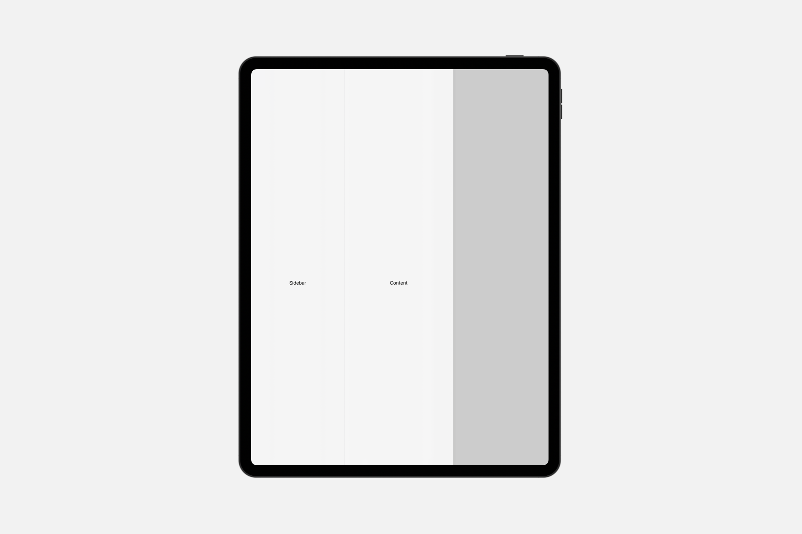
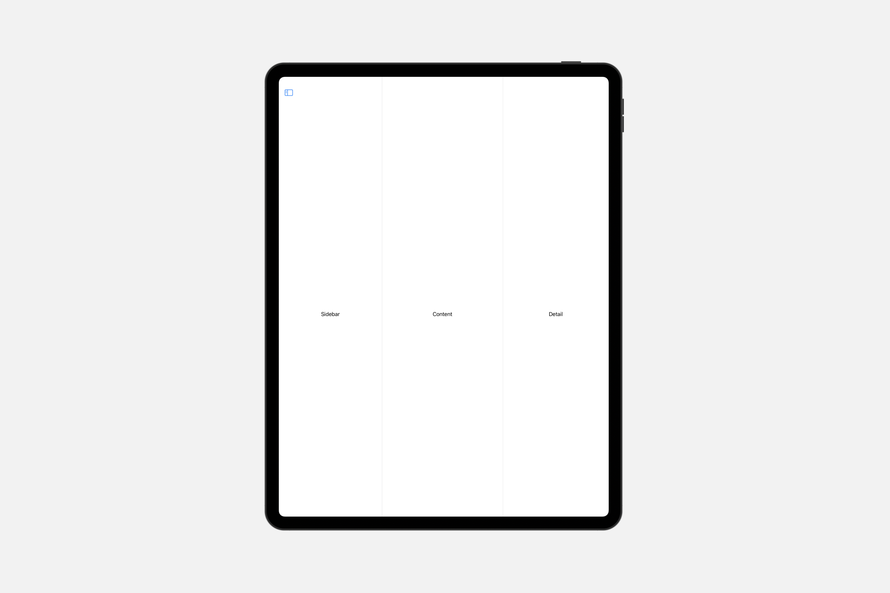

# Styling navigation views

## `navigationSplitViewStyle(_:)`

此操作为该视图中的导航分割视图设置样式。

```swift
func navigationSplitViewStyle<S>(_ style: S) -> some View where S : NavigationSplitViewStyle
```

### `automatic`

一种根据当前上下文自动确定其外观的导航分割样式。

```swift
NavigationSplitView {
    Text("Sidebar")
} content: {
    Text("Content")
} detail: {
    Text("Detail")
}
.navigationSplitViewStyle(.automatic)
```



### `balanced`

一种导航分割样式，当显示 `leading` 列或多列时，会减小详情内容的大小以腾出空间。

```swift
NavigationSplitView {
    Text("Sidebar")
} content: {
    Text("Content")
} detail: {
    Text("Detail")
}
.navigationSplitViewStyle(.balanced)
```




### `prominentDetail`

一种导航分割样式，尝试在隐藏或显示 `leading` 列时保持详情内容的大小不变。


## `tabViewStyle(_:)`

此操作为当前环境中的标签视图设置样式。

```swift
func tabViewStyle<S>(_ style: S) -> some View where S : TabViewStyle
```

### `automatic`

默认的 `TabView` 样式。

```swift
struct ContentView: View {

    var body: some View {
        TabView {

            List{
                LabeledContent("备注", value: "12345")
            }.tabItem {
                Label("首页", systemImage: "1.circle")
            }

            List{
                Toggle("开关", isOn: .constant(true))
            }.tabItem {
                Label("设置", systemImage: "gear")
            }

        }.tabViewStyle(.automatic)
    }
}
```
<video src="../../video/TabViewStyleAutomatic.mp4" controls="controls"></video>

### `page`

实现分页滚动的 `TabView` 样式。

```swift
TabView {
    Color.blue
    Color.yellow
}.tabViewStyle(.page)
```

<video src="../../video/TabViewStylePage.mp4" controls="controls"></video>


### `page(indexDisplayMode:)`

实现带有索引显示模式的分页滚动的 `TabView` 样式。

<video src="../../video/TabViewStylePageIndex.mp4" controls="controls"></video>

```swift
TabView {
    Color.blue
    Color.yellow
}.tabViewStyle(.page(indexDisplayMode: .never))
```


### `verticalPage` <Badge type="warning" text="watchOS" />

实现垂直页面交互和外观的 `TabView` 样式。

```swift
TabView {

    Color.blue
    Color.yellow
    Color.white

}.tabViewStyle(.verticalPage)
```
<video src="../../video/TabViewStyleVerticalPage.mp4" controls="controls"></video>

### `verticalPage(transitionStyle:)` <Badge type="warning" text="watchOS" />

```swift
TabView {

    Color.blue
    Color.yellow
    Color.white

}.tabViewStyle(.verticalPage(transitionStyle: .identity))
```
<video src="../../video/TabViewStyleVerticalPageIdentity.mp4" controls="controls"></video>
