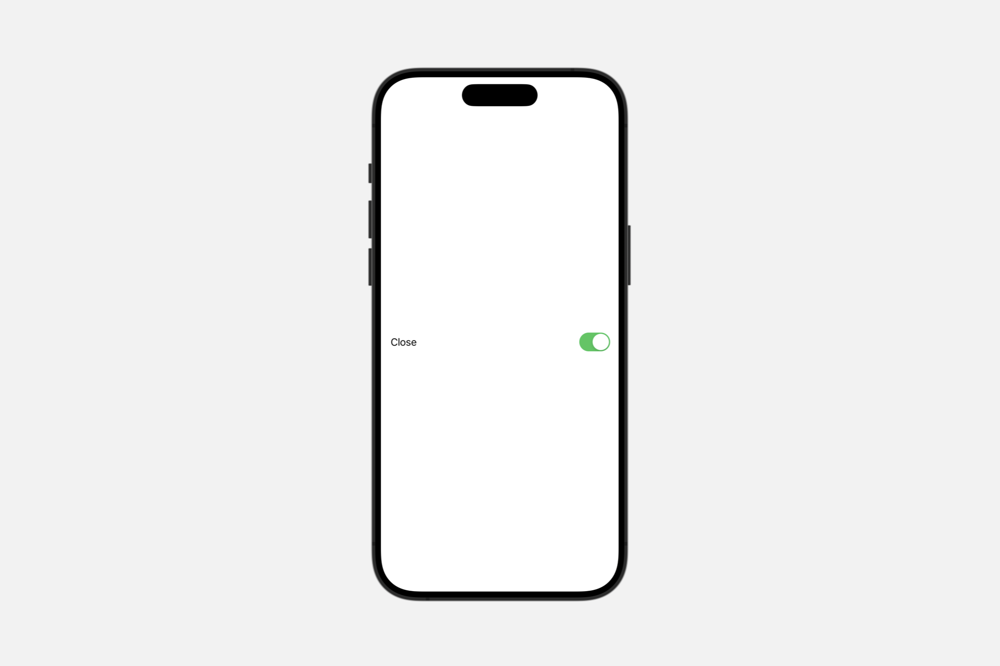
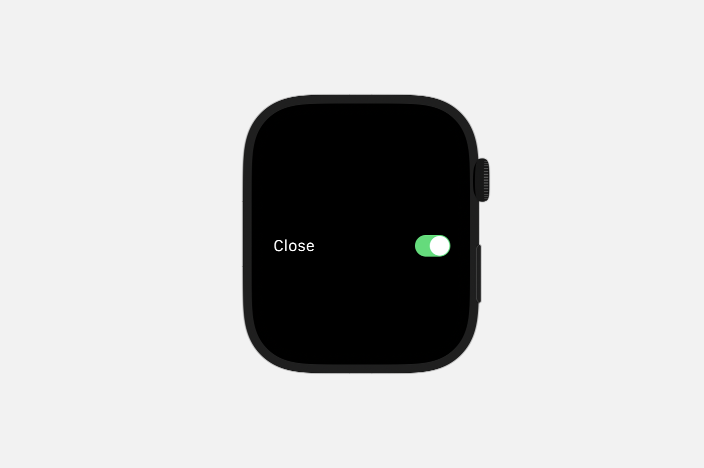

# Styling toggles


## `toggleStyle(_:)`

为视图层级中的切换按钮设置样式。

```swift
func toggleStyle<S>(_ style: S) -> some View where S : ToggleStyle
```

在 `Toggle` 实例上使用此修饰符，以设置定义控件外观和行为的样式。

::: info

类似于 `toggleStyle(_:)` 为切换按钮所做的，`labelStyle(_:)` 修饰符为层级中的 `Label` 实例设置样式。上面的示例演示了紧凑的仅图标样式( `compact iconOnly` )，这在空间受限的上下文中对按钮切换特别有用。为了更好的可访问性，请始终包含一个描述性的标题。

:::

### `automatic`

默认的切换按钮样式。

自动样式产生的外观根据平台不同而变化，在大多数上下文中使用以下样式：


| Platform        |      Default style      |
| ------------- | :-----------: |
| iOS, iPadOS      | switch|
| macOS      |   checkbox |
| tvOS      |   A tvOS-specific button style |
| watchOS      |   switch |

tvOS 的默认样式表现得像一个按钮。然而，与某些其他平台上可用的按钮样式不同，tvOS 切换按钮会占用其父容器提供的尽可能多的水平空间，并同时显示切换按钮的标签以及一个指示切换状态的文本字段。通常，你会将 tvOS 切换按钮收集到一个 `List` 中：

```swift
List {
    Toggle("Show Lyrics", isOn: $isShowingLyrics)
    Toggle("Shuffle", isOn: $isShuffling)
    Toggle("Repeat", isOn: $isRepeating)
}
```
<video src="../../video/ToggleStyleTVOS.mp4" controls="controls"></video>

切换按钮的自动外观在某些上下文中会有所不同：

作为你提供给任一工具栏修饰符（如 `toolbar(content:)` ）内容一部分出现的切换按钮，默认使用按钮样式。

出现在菜单中的切换按钮使用了一种无法显式创建的样式：

```swift
Menu("Playback") {
    Toggle("Show Lyrics", isOn: $isShowingLyrics)
    Toggle("Shuffle", isOn: $isShuffling)
    Toggle("Repeat", isOn: $isRepeating)
}
```

SwiftUI 显示切换按钮的标签，并且只在开启状态下显示勾选标记：

| Platform        |      Appearance      |
| ------------- | :-----------: |
| iOS, iPadOS      |  |
| macOS      |       |


### `button`

一种切换样式，显示为按钮，其标签作为标题。

```swift
Toggle(isOn: $isFlagged) {
    Label("Flag", systemImage: "flag.fill")
}
.toggleStyle(.button)
```

此样式生成一个带有标签的按钮，该标签描述了切换按钮的目的。用户点击或点击按钮来改变切换的状态。按钮通过用着色颜色填充背景来指示开启状态。你可以使用 `tint(_:)` 修饰符更改着色颜色。SwiftUI 将此样式作为出现在工具栏中的切换按钮的默认样式。

下表分别显示了关闭和开启状态下的切换按钮：


| Platform        |      Appearance      |
| ------------- | :-----------: |
| iOS, iPadOS      |  |
| macOS      |       |

`Label` 实例是作为按钮切换标签的一个不错选择。根据上下文，SwiftUI 会决定是否同时显示标题和图标，就像上述示例那样，或者仅当切换按钮出现在工具栏中时只显示图标。你也可以通过添加 `labelStyle(_:)` 修饰符来控制标签的样式。无论如何，SwiftUI 都会始终使用标题通过 `VoiceOver` 来识别控件。

### `checkbox` <Badge type="tip" text="macOS" />

一种切换样式，显示复选框后跟其标签。


```swift
Toggle("Close windows when quitting an app", isOn: $doesClose)
.toggleStyle(.checkbox)
```

此样式生成一个描述切换目的的标签和一个显示切换状态的复选框。要更改切换状态，用户需点击复选框或其标签：

<video src="../../video/ToggleStyleMacOS.mp4" controls="controls"></video>

该样式使复选框的尾部与标签的头部对齐，并根据需要占用水平空间以适应标签的宽度，直至达到切换按钮所在父视图所提供的最大宽度。

在大多数情况下，当你未设置特定样式或应用自动样式时，这便是 macOS 中的默认样式。表单是呈现一系列复选框并保持适当间距和对齐的理想方式。

### `switch`

一种切换样式，显示前置标签和后置开关。

```swift
Toggle("Enhance Sound", isOn: $isEnhanced)
.toggleStyle(.switch)
```

此样式生成一个描述切换功能的标签和一个显示切换状态的开关。用户点击或敲击开关来改变切换的状态。尽管在用户界面中使用开关的方式因平台而略有不同，如《人机界面指南》中的「切换控件」部分所述，但其默认外观在各平台间基本保持一致。

iOS



macOS


watchOS




在 iOS 和 watchOS 上，标签和开关会利用父容器提供的全部水平空间，通过将标签的起始边缘与容器视图的起始边缘对齐，以及将开关的结束边缘与容器视图的结束边缘对齐。而在 macOS 上，该样式为了尽可能减少水平空间的占用，会将标签的结束边缘与开关的起始边缘对齐。当此样式出现在表单中时，SwiftUI 会帮助你管理间距和对齐。

当你没有特别设置样式，或者应用了自动样式时，SwiftUI 在大多数情况下会将此样式作为 iOS 和 watchOS 上的默认样式。