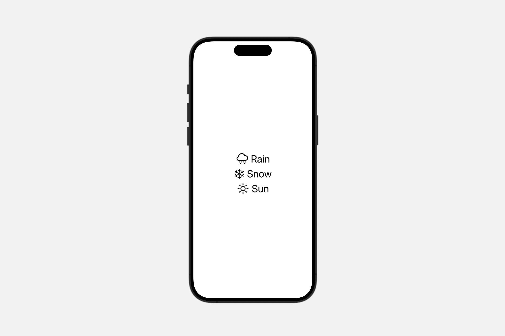
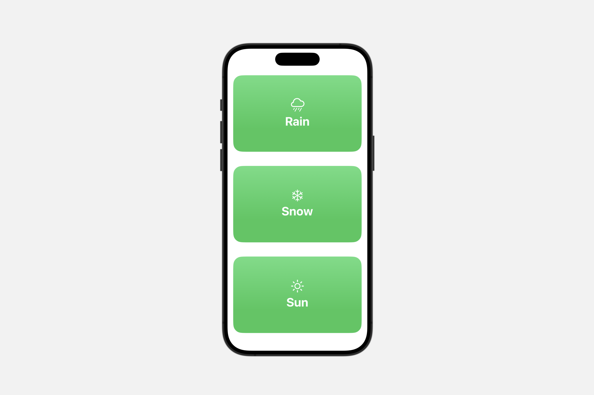
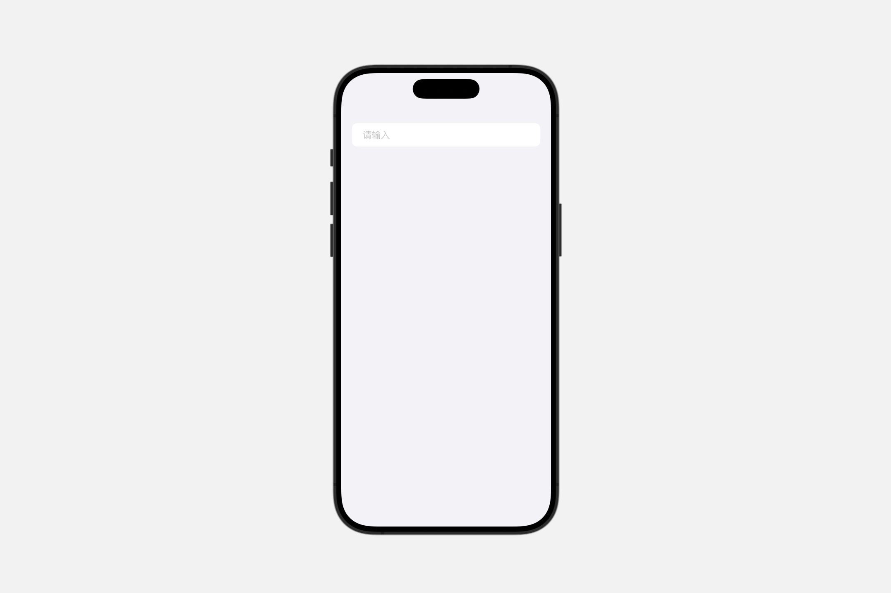
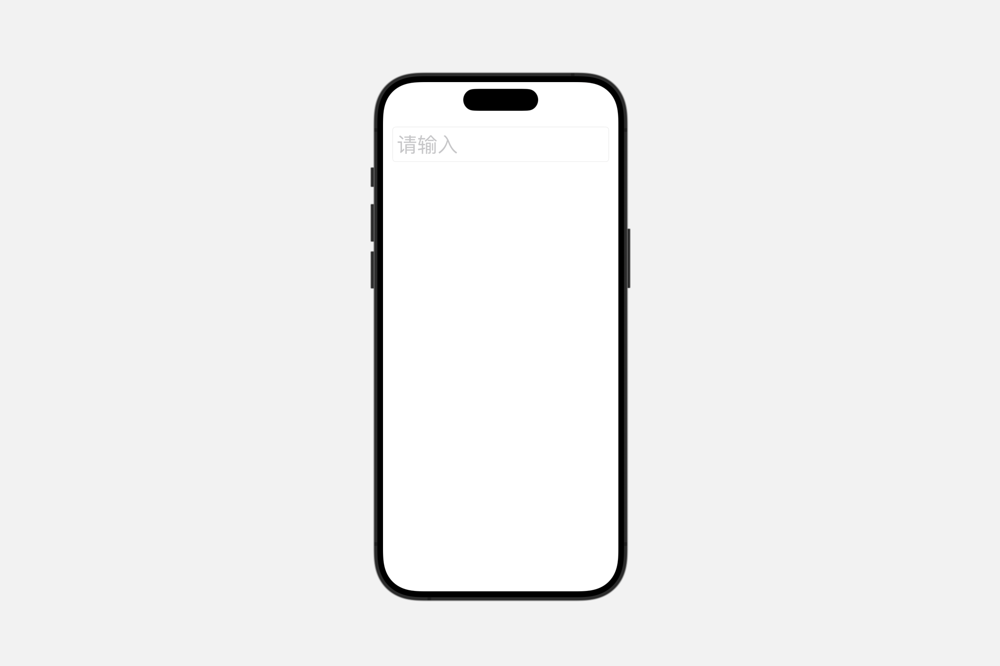
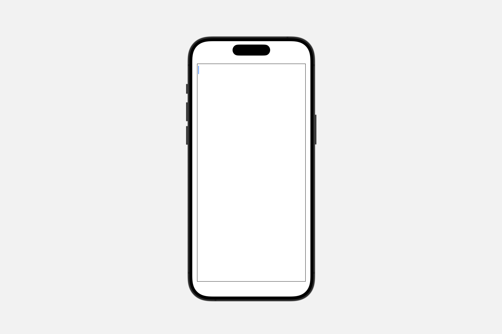

# Styling views that display text

## `labelStyle(_:)`

此操作为该视图中的标签设置样式。

```swift
func labelStyle<S>(_ style: S) -> some View where S : LabelStyle
```

### `automatic`

一种根据当前上下自动确定其外观的标签样式。

```swift
VStack {
    Label("Fire", systemImage: "flame.fill")
    Label("Lightning", systemImage: "bolt.fill")
}
.labelStyle(.automatic)
```


### `iconOnly`

一种仅显示标签图标的标签样式。


### `titleAndIcon`

一种使用系统标准布局同时显示标签的标题和图标的标签样式。

在大多数情况下，默认情况下标签都会同时显示其标题和图标。然而，某些容器可能对其内容应用了不同的默认标签样式，例如在 macOS 和 iOS 上仅在工具栏中显示图标。为了选择同时显示标题和图标，你可以应用 `titleAndIcon` 标签样式：

```swift
Label("Lightning", systemImage: "bolt.fill")
    .labelStyle(.titleAndIcon)
```

要将 `titleAndIcon` 样式应用于一组标签，需将其应用于包含这些标签的视图层次结构中：

```swift
VStack {
    Label("Rain", systemImage: "cloud.rain")
    Label("Snow", systemImage: "snow")
    Label("Sun", systemImage: "sun.max")
}
.labelStyle(.titleAndIcon)
```

标题和图标的相对布局取决于其显示的上下文环境。然而，在大多数情况下，标签是水平排列的，图标位于前方。



### `titleOnly`

一种仅显示标签标题的标签样式。


### Creating custom label styles

```swift
struct MyLabelStyle: LabelStyle {

    func makeBody(configuration: Configuration) -> some View {

        RoundedRectangle(cornerRadius: 25.0)
            .fill(.green.gradient)
            .overlay {
                VStack {
                    configuration.icon
                    configuration.title
                        .bold()
                }.foregroundStyle(.white)

            }.padding()
    }
}
```




## `textFieldStyle(_:)`

此操作为该视图中的文本字段设置样式。

```swift
func textFieldStyle<S>(_ style: S) -> some View where S : TextFieldStyle
```

### `automatic`

根据文本字段所在上下文环境的默认文本字段样式。

默认样式代表了根据当前平台及文本字段在视图层级结构中的上下文环境所推荐的样式。

```swift
Form {
    TextField("请输入", text: $text)
        .textFieldStyle(.automatic)
}
```




### `plain`

一种无装饰的文本字段样式。

```swift
Form {
    TextField("请输入", text: $text)
        .textFieldStyle(.plain)
}
```

### `roundedBorder`

一种带有系统定义圆角边框的文本字段样式。

```swift
ScrollView {
    TextField("请输入", text: $text)
        .textFieldStyle(.roundedBorder)
        .font(.largeTitle)
}.padding()
```




### `squareBorder` <Badge type="tip" text="macOS" />

一种带有系统定义方形边框的文本字段样式。

```swift
TextField("请输入", text: $text)
    .textFieldStyle(.squareBorder)
    .frame(width: 200)
```


## `textEditorStyle(_:)`

此操作为该视图中的文本编辑器设置样式。


```swift
func textEditorStyle(_ style: some TextEditorStyle) -> some View
```


### `automatic`

根据文本编辑器上下文环境的默认文本编辑器样式。


### `plain`

一种无装饰的文本编辑器样式。

```swift
TextEditor(text: $text)
    .textEditorStyle(.plain)
    .border(Color.black)
    .padding()
```




### `roundedBorder` <Badge type="info" text="visionOS" />

一种带有系统定义圆角边框的文本编辑器样式。

