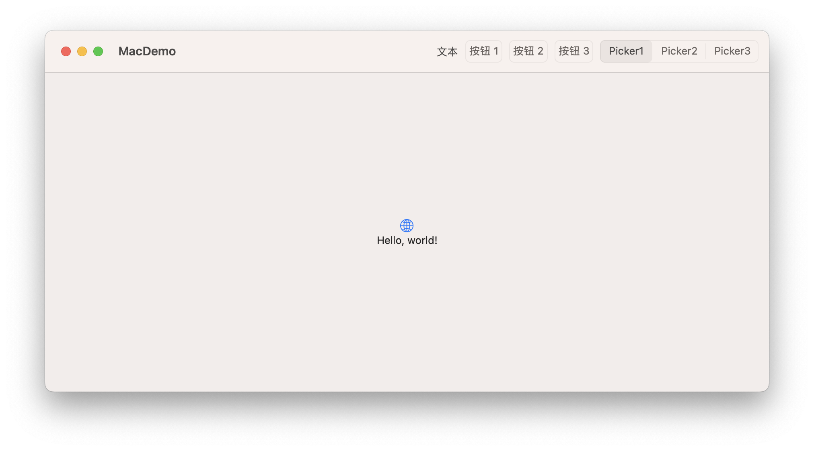
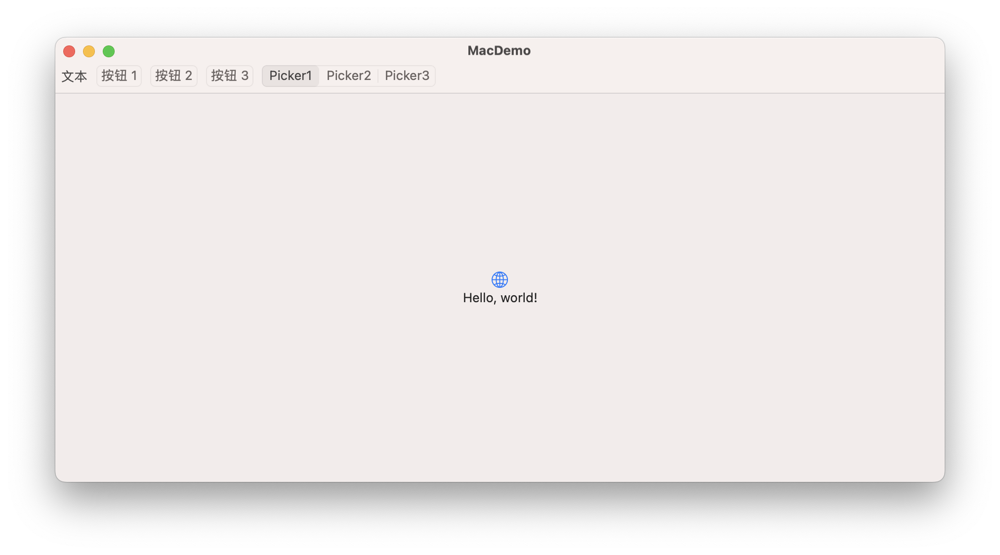
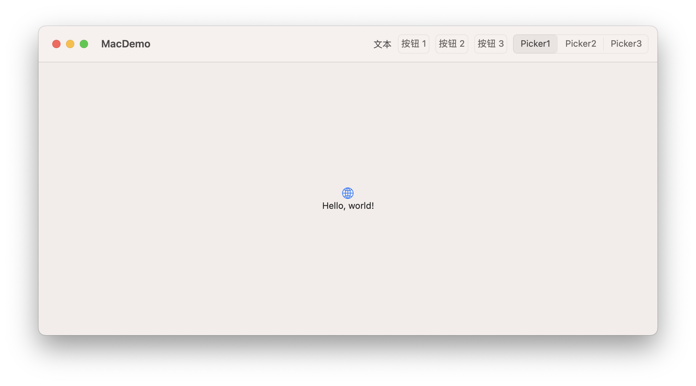
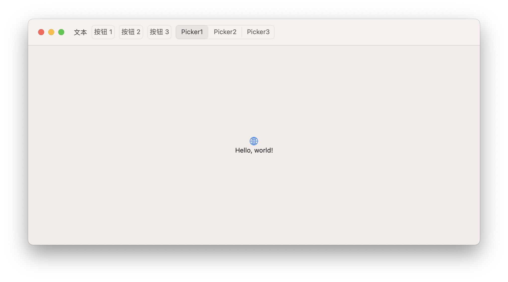
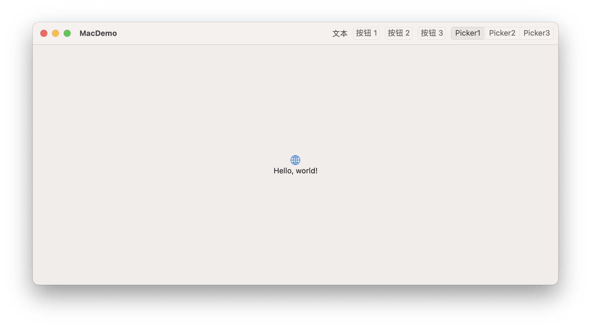
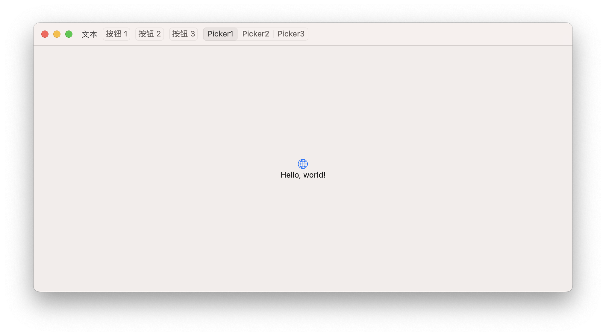

# Styling the associated toolbar <Badge type="tip" text="macOS" />

设置此场景中定义的工具栏的样式。

## `automatic`

默认的工具栏样式。


```swift
WindowGroup() {
    ContentView().toolbar(content: {
      ...      
    })
}.windowToolbarStyle(.automatic)
```




## `expanded`

在工具栏上方显示其标题栏。

```swift
WindowGroup() {
    ContentView().toolbar(content: {
        ...
    })
}.windowToolbarStyle(.expanded)
```




## `unified`

内嵌显示其工具栏和标题栏。

```swift
WindowGroup() {
    ContentView().toolbar(content: {
        ...
    })
}.windowToolbarStyle(.expanded)
```




## `unified(showsTitle:)`

内嵌显示其工具栏和标题栏。

- `showsTitle`: 是否展示标题（ `Bool` ），默认为 `true`，等同于上例。

```swift
WindowGroup() {
    ContentView().toolbar(content: {
        ...
    })
}.windowToolbarStyle(.unified(showsTitle: false))
```




## `unifiedCompact`

工具栏样式与 `unified` 类似，但垂直尺寸更紧凑。

```swift
WindowGroup() {
    ContentView().toolbar(content: {
        ...
    })
}.windowToolbarStyle(.unifiedCompact)
```




## `unifiedCompact(showsTitle:)`

工具栏样式与 `unified` 类似，但垂直尺寸更紧凑。

- `showsTitle`: 是否展示标题（ `Bool` ），默认为 `true`，等同于上例。


```swift
WindowGroup() {
    ContentView().toolbar(content: {
        ...
    })
}.windowToolbarStyle(.unifiedCompact(showsTitle: false))
```

