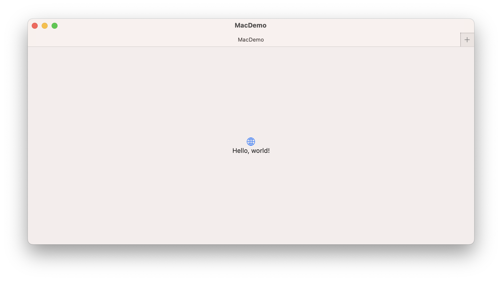
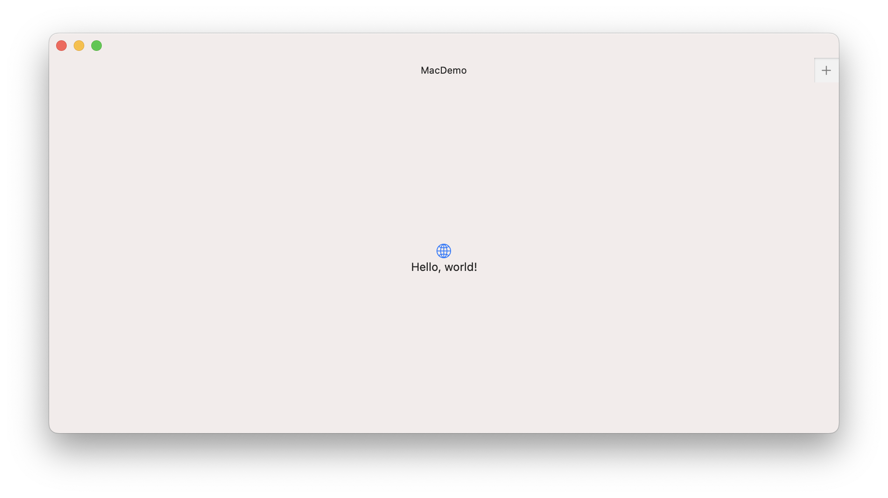
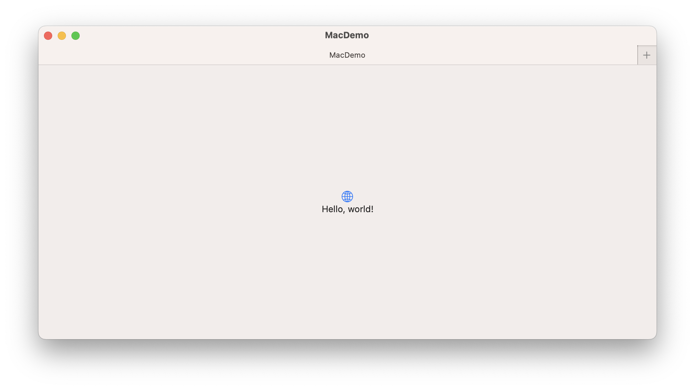
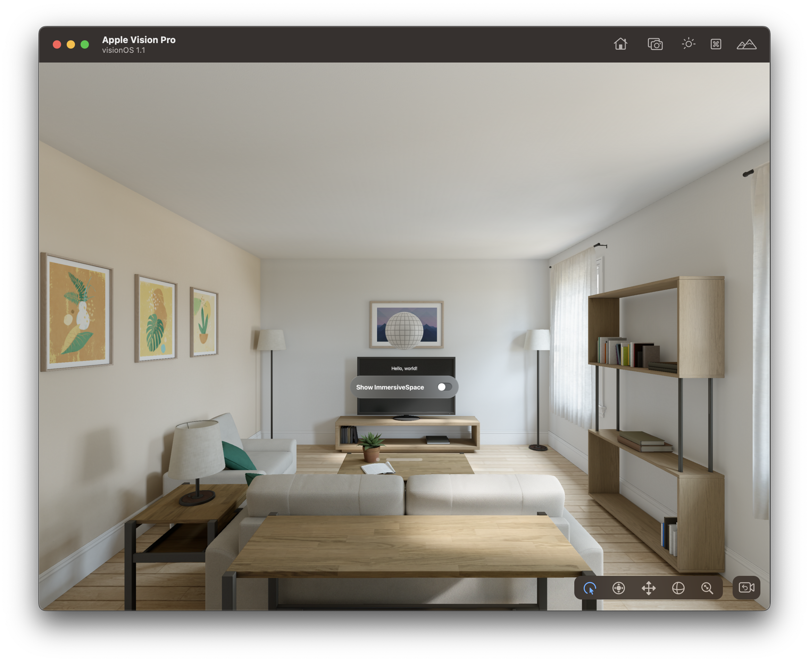
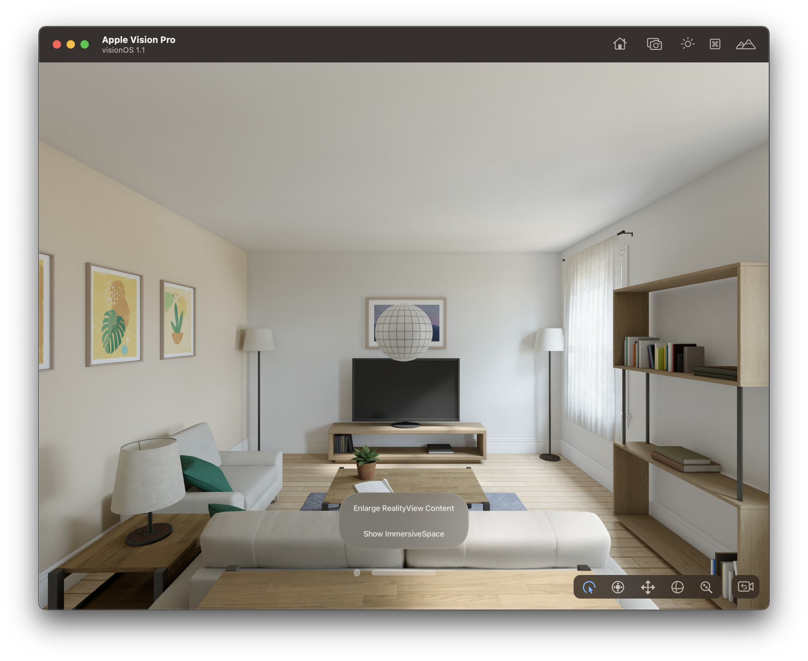

# WindowStyle <Badge type="tip" text="macOS" /> <Badge type="info" text="visionOS" />

SwiftUI 提供了几种默认的窗口外观：

## DefaultWindowStyle

默认的窗口样式


```swift
WindowGroup() {
    ContentView()
}.windowStyle(.automatic)
```




## HiddenTitleBarWindowStyle

隐藏窗口标题和标题栏区域背景的窗口样式，允许显示更多窗口内容。

```swift
 WindowGroup() {
    ContentView()
}.windowStyle(.hiddenTitleBar)
```



## TitleBarWindowStyle <Badge type="tip" text="macOS" />

显示窗口标题栏部分的窗口样式，也是 macOS 的默认样式。

```swift
    WindowGroup() {
                ContentView()
}.windowStyle(.titleBar)
```




## PlainWindowStyle <Badge type="info" text="visionOS" />

visionOS 平台上的最简风格窗口。


```swift
WindowGroup {
    ContentView()
}.windowStyle(.plain)
```




## VolumetricWindowStyle <Badge type="info" text="visionOS" />

创建 `3D` 立体窗口的窗口样式。

```swift
WindowGroup() {
    ContentView()
}.windowStyle(.volumetric)
```

